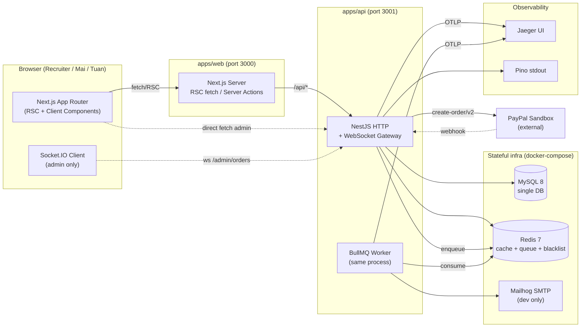
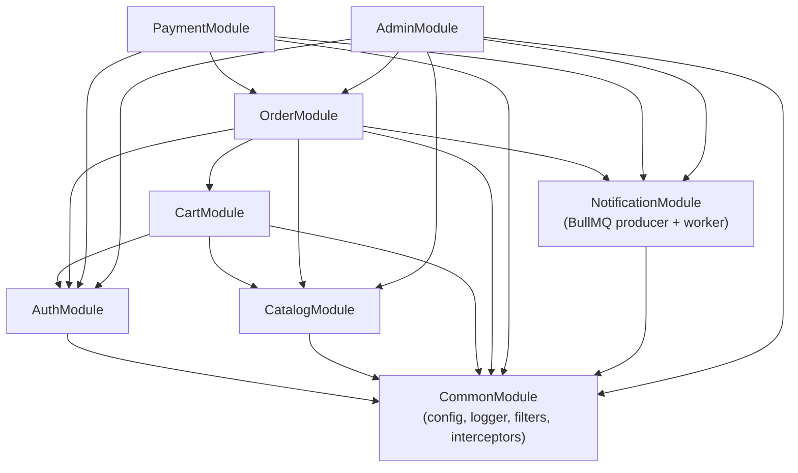
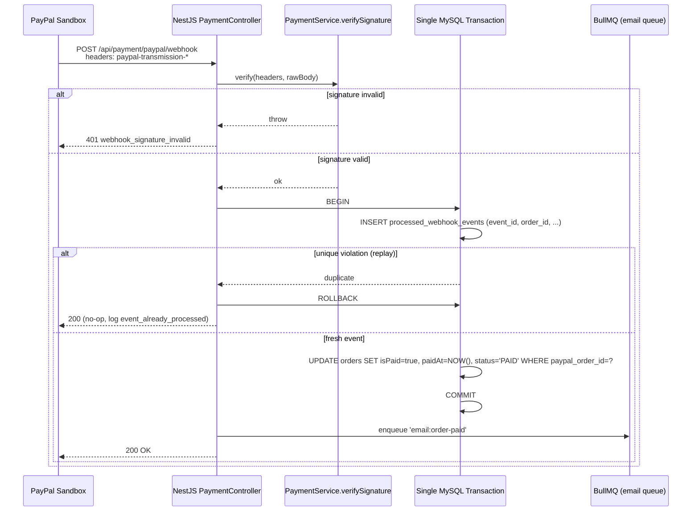
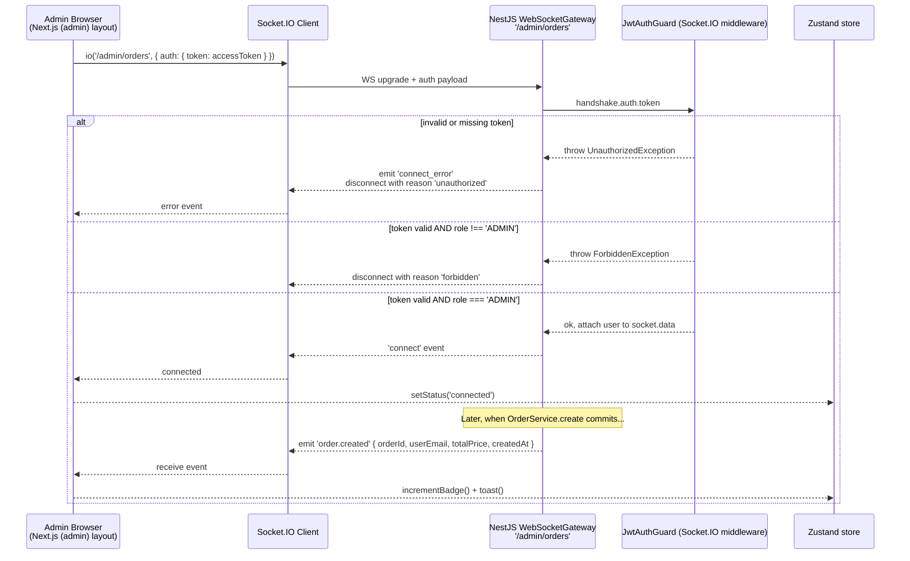
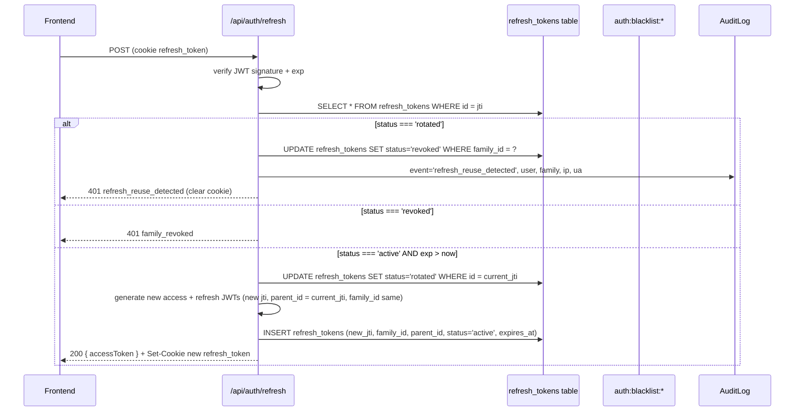
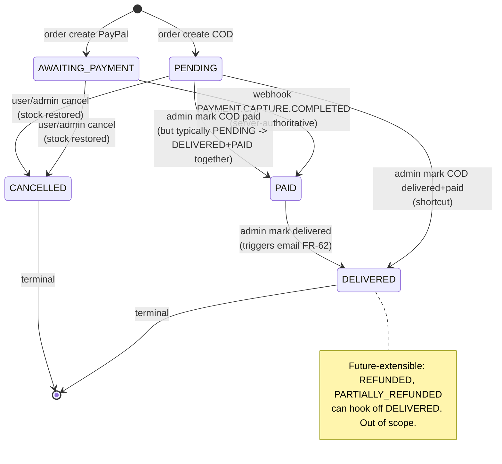
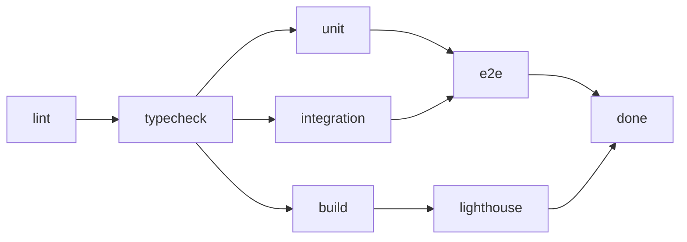

# Architecture Decision Document — Prodigy Glasses Remake

> Status: 🟢 COMPLETE — all 7 OQ recommendations accepted. Document is the architectural source of truth for downstream BMad phases (epics & stories, implementation).
>
> **Reading order**: This document inherits all locked decisions from `brief.md` (status=complete) and `prd.md` (status=final). Where decisions are inherited, the rationale is summarised inline, not re-debated. Where new decisions are made (the 7 OQ items), each carries `Options Considered → Recommendation → Consequences → Reversibility`.
>
> **Bilingual style**: Headers, FR cross-refs, ADR shapes in English. Conversational reasoning in Vietnamese where it earns its place. Diagrams are mermaid (renders on GitHub for recruiter).

---

## 1. Executive Summary

Prodigy Glasses Remake là **modular monolith TypeScript** chạy trên 1 process NestJS backend + 1 process Next.js frontend, share state qua **single MySQL 8** + **single Redis 7**, communicate qua **REST cho public/admin HTTP** và **Socket.IO WebSocket** cho admin realtime feed. Backend chia thành 8 module theo domain (Auth, Catalog, Cart, Order, Payment, Notification, Admin, Common); frontend dùng Next.js App Router với 3 route groups (`(public)`, `(auth)`, `(admin)`) — RSC mặc định, `'use client'` chỉ ở chỗ thật sự cần interactivity. Persistence dùng **TypeORM + MySQL** với **single ACID transaction** ôm trọn checkout (no Saga, no Outbox); reads catalog đi qua **Redis cache-aside** TTL 30-300s với invalidation explicit từ admin writes; emails đi qua **BullMQ** trên cùng Redis instance; PayPal integration là **server-authoritative** với **webhook signature verify + idempotency table**. Observability bằng OpenTelemetry → Jaeger và Pino structured logs.

**Key callouts** (chi tiết trong §4):

- Modular monolith over microservices (inherited brief §1.2).
- Single MySQL ACID transaction over Saga (inherited PRD FR-25).
- Cache-aside Redis với **flat namespace + SCAN-and-DEL invalidation** (resolves [OQ-02]).
- JWT access (15min in-memory) + refresh token rotation cookie với **`Path=/api/auth`** và reuse-detection family revoke (resolves [OQ-07]).
- BullMQ on Redis cho email queue (3 retries, exponential backoff 1s/5s/25s).
- Next.js App Router + RSC default + ISR `revalidate=60` cho PDP.
- WebSocket admin gateway với **first-message auth (Socket.IO `auth` payload)** (resolves [OQ-03]).
- shadcn/ui boundary cho `(admin)`, vanilla Tailwind cho `(public)`.
- Lighthouse CI portfolio-baseline: Performance ≥90 trên PLP/PDP, accessibility ≥90 (resolves [OQ-01]).

**Success criteria callback**: Architecture phải support 8 exit-gate điều kiện trong PRD §1.4 (7/7 E2E green, ≥70% service coverage, Lighthouse ≥90, 24 anomalies fixed, ≥6 ADRs, README portfolio-grade, <5min run-locally, code-review clean).

---

## 2. Project Context

### 2.1 Brownfield-greenfield rewrite framing

Đây là **greenfield rewrite** của hệ MERN cũ (`Prodigy-glasses-MERN/`, read-only). Không có user thật, không có data thật, không strangler-fig, không dual-write. Repo `prodigy-glasses-remake/` là project mới hoàn toàn; legacy giữ làm reference cho recruiter so sánh "from → to" (link trong README). Anomaly catalogue (#A1–#A27) được trích từ legacy và 24 trong số đó phải có commit fix có thể truy vết.

### 2.2 Architectural drivers

**Functional drivers (must-have capabilities)** — drive shape của module split:

- Authentication với JWT rotation + reuse detection → AuthModule.
- Catalog browse/search/filter với cache-aside → CatalogModule.
- Cart server-side persisted + checkout transaction → CartModule + OrderModule.
- PayPal sandbox + COD payment với webhook idempotency → PaymentModule.
- Email notifications async → NotificationModule (BullMQ producer + consumer).
- Admin CRUD + dashboard + WebSocket new-orders feed → AdminModule.
- 5 cross-cutting concerns (logging, errors, DTOs, guards, env config) → CommonModule.

**Quality drivers (NFRs)** — drive tech-pattern choices:

- **Performance** (NFR-01): Lighthouse ≥90 trên PLP/PDP → drives RSC + ISR + cache-aside + image optimization.
- **Security** (NFR-02): 24 anomaly fixes + JWT rotation + webhook signature → drives default-deny RBAC, httpOnly cookies, signature verify.
- **Reliability** (NFR-03): atomic order create + idempotent webhook + queue retry → drives single transaction, dedup table, BullMQ.
- **Observability** (NFR-04): OpenTelemetry + Pino → drives instrumented HTTP/DB/cache/queue spans.
- **Quality** (NFR-05): ≥70% coverage + 7 E2E + strict TS → drives test pyramid + testcontainers.
- **Maintainability** (NFR-06): ≥6 ADRs + README + animated GIFs → drives ADR-shaped decisions in this doc.

### 2.3 Constraints

- **Solo dev, 5-week timebox** — drives "single-process monolith" over distributed system. Mọi pattern không serve recruiter signal sẽ bị defer.
- **Local-first** — drives `docker compose up` is the only deployment target. No CD, no cloud config.
- **Stack locked** — NestJS, TypeORM, MySQL 8, Redis 7, BullMQ, Next.js App Router, Tailwind, shadcn/ui (admin only), TanStack Query, Zustand, RHF+Zod, Jest, Testcontainers, Playwright. Architecture document đảm nhiệm cấu hình các pieces này, KHÔNG re-debate stack.
- **No real users / data** — drives greenfield seed strategy. PRD § 1.4 + brief § 6.1.
- **Vietnamese UI, English code/log/commit** — drives i18n-not-required và copy-style guide.

### 2.4 What this document is and is not

**Is**: ADR-shaped decision document at the **patterns + structures + boundaries** layer. Module dependency graph. Data model. Cross-cutting concern strategies. Concrete OQ resolutions.

**Is not**: Method-signature-level design. Pixel design. Feature requirements (PRD already final). Story implementation plan (sprint plan in brief §4.3 + PRD §5.2).

---

## 3. Architecture Overview

### 3.1 High-level component view



> Lưu ý: `Worker` chạy cùng process với HTTP API trong scope (single deployment unit). Tách worker thành process riêng là future work khi scale.

### 3.2 Repository structure

**Workspace tool**: npm workspaces (brief §6.1, user preference). Monorepo root chứa 2 apps + 1-2 packages.

```
prodigy-glasses-remake/
├── apps/
│   ├── api/                          # NestJS modular monolith
│   │   ├── src/
│   │   │   ├── modules/
│   │   │   │   ├── auth/
│   │   │   │   ├── catalog/
│   │   │   │   ├── cart/
│   │   │   │   ├── order/
│   │   │   │   ├── payment/
│   │   │   │   ├── notification/
│   │   │   │   ├── admin/
│   │   │   │   └── common/
│   │   │   ├── config/               # Zod env schema
│   │   │   ├── database/             # TypeORM data source + migrations
│   │   │   │   └── migrations/
│   │   │   ├── observability/        # OTel setup
│   │   │   └── main.ts
│   │   ├── test/                     # E2E (supertest) + integration
│   │   ├── templates/                # email .hbs
│   │   └── package.json
│   └── web/                          # Next.js App Router
│       ├── src/
│       │   ├── app/
│       │   │   ├── (public)/
│       │   │   ├── (auth)/
│       │   │   ├── (admin)/
│       │   │   ├── api/              # Next API routes minimal (BFF if needed)
│       │   │   ├── layout.tsx
│       │   │   └── globals.css
│       │   ├── components/
│       │   │   ├── ui/               # shadcn/ui — admin-only
│       │   │   ├── public/           # vanilla Tailwind — public-only
│       │   │   └── shared/           # cross-cutting (links, icons)
│       │   ├── lib/                  # api client, paypal, auth helpers
│       │   ├── hooks/
│       │   └── store/                # zustand stores
│       ├── playwright/               # E2E specs
│       └── next.config.js
├── packages/
│   ├── shared-types/                 # TS types + Zod schemas (FE↔BE)
│   │   └── src/
│   │       ├── schemas/              # Zod
│   │       └── types/                # exported types
│   └── eslint-config/                # (optional) shared eslint flat config
├── docker/
│   ├── docker-compose.yml            # mysql, redis, jaeger, mailhog, api, web
│   └── docker-compose.test.yml       # ephemeral stack for integration tests
├── .github/workflows/
│   └── ci.yml                        # lint → typecheck → unit → integration → e2e → build
├── docs/
│   ├── ADRs/                         # ≥6 ADRs (brief §5.2 NFR-06 AC2)
│   ├── architecture.md               # short link summary → planning-artifacts/architecture.md
│   └── runbook.md                    # local dev runbook
├── package.json                      # workspaces declared here
├── tsconfig.base.json
├── .lighthouserc.json
├── .commitlintrc.cjs
├── .husky/
└── README.md
```

### 3.3 Backend module dependency graph



**Rule of thumb**: dependency edges **chỉ chiều dưới-lên** (e.g., `Order` depends on `Cart` and `Catalog`, never ngược lại). Không có cyclic import. `Common` không depend vào ai. `Admin` re-export thin admin-only controllers, business logic nằm trong domain modules (e.g., admin update product gọi `CatalogService.updateById(...)` chứ không re-implement).

### 3.4 Frontend route group layout

```
apps/web/src/app/
├── layout.tsx                 # root html, fonts, providers
├── (public)/
│   ├── layout.tsx             # public header + footer
│   ├── page.tsx               # home
│   ├── products/
│   │   ├── page.tsx           # PLP (RSC)
│   │   └── [id]/
│   │       └── page.tsx       # PDP (RSC + ISR revalidate=60)
│   ├── cart/page.tsx          # client component (TanStack Query)
│   ├── checkout/page.tsx      # mixed (RSC shell + client form)
│   └── orders/
│       ├── page.tsx           # MyOrders (RSC)
│       └── [id]/page.tsx      # OrderDetail (RSC)
├── (auth)/
│   ├── layout.tsx             # minimal — no header/footer
│   ├── sign-in/page.tsx       # Server Action form
│   └── sign-up/page.tsx       # Server Action form
└── (admin)/
    ├── layout.tsx             # client guard + Socket.IO bootstrap
    ├── dashboard/page.tsx     # mixed (RSC fetch + client charts)
    ├── users/page.tsx
    ├── products/page.tsx
    ├── categories/page.tsx
    ├── orders/page.tsx
    ├── comments/page.tsx
    └── audit-log/page.tsx     # FR-79
```

### 3.5 Communication contracts at a glance

| From → To                | Channel                | Format                   | AuthN                                         |
| ------------------------ | ---------------------- | ------------------------ | --------------------------------------------- |
| Browser → Next.js Server | HTTP (Next.js routing) | HTML + JSON (RSC stream) | Cookie session (refresh) + memory access      |
| Next.js Server → API     | HTTP                   | JSON                     | Forwarded JWT                                 |
| Browser direct → API     | HTTP                   | JSON                     | Bearer access token                           |
| Admin browser → API      | WebSocket (Socket.IO)  | binary frames            | First-message `auth.token` (resolves [OQ-03]) |
| API → MySQL              | TCP                    | TypeORM SQL              | env credentials                               |
| API → Redis              | TCP                    | RESP3 (ioredis)          | env password                                  |
| API → PayPal             | HTTPS REST             | JSON                     | Client credentials (env)                      |
| PayPal → API webhook     | HTTPS POST             | JSON + headers           | PayPal signature verify                       |
| API → Mailhog SMTP       | TCP                    | SMTP                     | (dev) no auth                                 |
| All apps → Jaeger        | OTLP/gRPC              | OpenTelemetry            | dev local                                     |

---

## 4. Core Architectural Decisions

> Mỗi decision dưới đây được structure như mini-ADR: `Context → Options Considered → Decision → Rationale → Consequences (positive + negative) → Reversibility`. Decisions inherited từ brief/PRD được consolidate ở đây (không re-debate); 4 OQ resolutions có "options considered" thực sự.

### 4.1 ADR-01 — Modular monolith over microservices

- **Context**: Solo dev, 5 tuần, no real traffic. Brief §1 đã reject 4-service draft (gRPC + Kafka + Saga + Outbox + dual-write).
- **Options Considered**:
  1. 4-service split (Auth / Catalog / Order-Payment / Notification) với gRPC + Kafka.
  2. Modular monolith với module-per-domain trong 1 NestJS app.
  3. Hexagonal monolith với explicit ports/adapters per domain.
- **Decision**: **Modular monolith** (option 2).
- **Rationale**: Solo + 5 tuần + no traffic làm option 1 thành cargo-cult signal — recruiter senior sẽ thấy mismatch giữa scope và shape. Option 3 tăng ADR-able depth nhưng cost-to-benefit thấp khi domain còn nhỏ. Module boundary trong NestJS đã đủ rõ để future extraction (Auth là candidate đầu tiên — ports đã clean qua DTO + service interface).
- **Consequences**:
  - **+** 1 process, 1 deployment unit, 1 logging aggregator, 1 transaction boundary → drastically simpler.
  - **+** Saga/Outbox xuất hiện ở "future work" → recruiter thấy awareness mà không cargo.
  - **−** Coupling implicit dễ leak (e.g., Order import OrderItem từ Cart) — phải discipline qua module boundary review trong code-review skill.
  - **−** Khi extract sang microservice future, sẽ phải design contract (gRPC proto) — nhưng đó chính là điểm muốn signal.
- **Reversibility**: **Medium**. Module boundary clean → extraction Auth thành Auth Service ước tính 1-2 tuần effort khi cần.

### 4.2 ADR-02 — Single MySQL + single ACID transaction over Saga

- **Context**: Checkout chain `validate cart → check stock → decrement stock → insert Order → insert OrderItems → clear cart` cần atomic.
- **Options Considered**:
  1. Saga orchestration (compensating transactions per step).
  2. Single ACID transaction (TypeORM `dataSource.transaction(...)`) với pessimistic lock trên Product rows.
  3. Optimistic locking (version column trên Product) + retry loop.
- **Decision**: **Single ACID transaction with pessimistic lock** (option 2).
- **Rationale**: Single MySQL = single transaction boundary. Saga là design cho cross-service compensations — không có service nào để compensate. Pessimistic lock (`SELECT ... FOR UPDATE`) đơn giản và đúng cho concurrent decrement; optimistic + retry phức tạp hơn cho lợi ích zero ở scale này.
- **Consequences**:
  - **+** Stock decrement atomic, không over-sell, rollback tự động khi fail.
  - **+** Test integration đơn giản: testcontainers MySQL + 1 test case "concurrent insert cùng product fails second one".
  - **−** Lock contention nếu high-concurrency same-product — không phải vấn đề ở portfolio scale (1-2 user).
  - **−** Khi tách sang microservices future, transaction boundary bị break → Saga sẽ replace.
- **Reversibility**: **Medium-low**. Refactor sang Saga đòi hỏi thay đổi domain model (compensation events, status machine) — đó là "future work" chính cho project này (brief §9 item 3).

### 4.3 ADR-03 — Cache-aside Redis với flat namespace + SCAN-and-DEL invalidation

- **Context**: Catalog reads (PLP, PDP, categories list) cần fast với cache TTL + invalidation khi admin write. PRD FR-13, FR-14. Resolves **[OQ-02]**.
- **Options Considered**:
  1. **Flat namespace**: `catalog:product:{id}`, `catalog:products:list:{queryHash}`, `catalog:categories:all`. Invalidate qua `SCAN MATCH catalog:products:list:* | DEL`.
  2. **Versioned namespace**: `catalog:product:{id}:v{N}`, bump version trên write. Invalidate qua single SET cmd (no SCAN needed).
  3. **Tag-based**: maintain Redis sets `tag:product:{id} → [list_keys, product_key]`, invalidate qua SMEMBERS + DEL.
- **Decision**: **Flat namespace + SCAN-and-DEL** (option 1).
- **Rationale**: Tag-based và versioned đều more elegant nhưng add operational complexity (tag maintenance, version bump consistency). Flat + SCAN đủ ở scale này (≤30 products, ≤6 categories trong seed) và dễ reason về ADR. SCAN với MATCH pattern + COUNT 100 không block Redis. Khi catalog scale future >10k keys, migration path là switch sang tag-based — boundary là `CacheService` class nên reversibility cao.
- **Consequences**:
  - **+** Đơn giản: 1 cache key per resource + SCAN pattern per invalidation hook.
  - **+** Easy to debug: `redis-cli KEYS catalog:*` cho dev inspection.
  - **+** Cache invalidation test (E2E #4) straightforward.
  - **−** SCAN ở scale lớn (>10k keys) có cost; mitigation = COUNT batch + non-blocking iterator.
  - **−** Race condition window: write commit → SCAN-and-DEL → read between commit & DEL có thể return stale. Acceptable (≤1s window) cho portfolio scale.
- **Reversibility**: **High**. `CacheService` lớp thin abstraction → swap implementation sang tag-based không touch domain code.
- **Concrete keys** (xem §5.4 cho full table):

| Key pattern                         | TTL                    | Invalidation trigger            |
| ----------------------------------- | ---------------------- | ------------------------------- |
| `catalog:product:{id}`              | 60s                    | admin update/delete product     |
| `catalog:products:list:{queryHash}` | 30s                    | admin update/delete any product |
| `catalog:categories:all`            | 300s                   | admin write category            |
| `auth:blacklist:{jti}`              | TTL=remaining JWT life | sign-out, reuse-detect          |
| `auth:rate-limit:{ip}:{endpoint}`   | 60s sliding            | always sliding window           |
| `webhook:processed:{eventId}`       | 7d                     | natural TTL eviction            |
| `admin:dashboard:kpis`              | 60s                    | order create/update             |

### 4.4 ADR-04 — JWT access (memory) + refresh rotation cookie với reuse detection

- **Context**: PRD FR-04, FR-05 mandate rotation + reuse detection. Refresh token must be httpOnly cookie only (`#A12`). Resolves **[OQ-07]** (cookie path scope).
- **Options Considered (cookie path scope)**:
  1. `Path=/api/auth/refresh` — narrowest scope, cookie chỉ gửi khi gọi refresh endpoint.
  2. `Path=/api/auth` — bao luôn `sign-out`, `me`, `refresh` endpoints.
  3. `Path=/api` — gửi với mọi API request, broader CSRF surface.
  4. `Path=/` — gửi với mọi request including Next.js page loads.
- **Decision**: **`Path=/api/auth`** (option 2).
- **Rationale**: Option 1 narrowest và đẹp nhất về security, NHƯNG `sign-out` endpoint cũng cần đọc refresh cookie để revoke family → mở scope cho `/sign-out` thành special-case ugly. Option 2 nhất quán: tất cả auth-lifecycle endpoints (refresh, sign-out, sign-up sets cookie, sign-in sets cookie) đều dưới `/api/auth/*` nên scope khít. Option 3-4 mở rộng CSRF surface không cần thiết.
- **Consequences**:
  - **+** Cookie chỉ travel trong auth-lifecycle requests → CSRF surface minimal.
  - **+** SameSite=Strict + httpOnly + Secure đảm bảo defense in depth.
  - **−** Nếu future thêm endpoint cần refresh cookie ngoài `/api/auth/*`, phải re-issue cookie với scope rộng hơn (one-time migration).
- **Reversibility**: **High**. Cookie path là 1 dòng config; user re-login để get new cookie.

**Token shape & TTLs (consolidated from PRD)**:

| Token       | Storage                                                  | TTL    | Claims                                |
| ----------- | -------------------------------------------------------- | ------ | ------------------------------------- |
| Access JWT  | Browser memory (React state) — NOT localStorage          | 15min  | `{ sub, role, jti, iat, exp }`        |
| Refresh JWT | httpOnly Secure SameSite=Strict cookie, `Path=/api/auth` | 7 days | `{ sub, family_id, parent_id?, jti }` |

Reuse detection (PRD FR-05):

- DB table `refresh_tokens` columns `id (jti) | user_id | family_id | parent_id | status (active|rotated|revoked) | created_at | expires_at`.
- Refresh request: lookup JTI, if `status=rotated` → set entire family `revoked` + audit log + 401.
- Logout: blacklist current access JTI in Redis with TTL = remaining lifetime + revoke entire refresh family.

### 4.5 ADR-05 — PayPal webhook idempotency (server-authoritative)

- **Context**: PayPal capture confirms via webhook; replay is normal (PayPal retries if 5xx). Server cannot trust client `isPaid: true`. PRD FR-31, FR-32, FR-33.
- **Options Considered**:
  1. Idempotency key in HTTP header (client-supplied) + Redis dedup.
  2. **Server-side dedup table** (`processed_webhook_events`) keyed by PayPal `event.id`, atomic insert in same transaction as Order update.
  3. Distributed lock (Redlock) per Order ID for single-flight.
- **Decision**: **Server-side dedup table** (option 2).
- **Rationale**: PayPal event ID là unique identifier from provider — perfect natural key. Dedup table in MySQL (same DB as Order) → one transaction wraps both `INSERT INTO processed_webhook_events` (with unique constraint on event_id) + `UPDATE orders SET isPaid=true`. If duplicate, INSERT fails with unique violation → rollback → 200 response (no-op). Option 1 không applicable (PayPal là external sender, không pass our keys). Option 3 over-engineered.
- **Consequences**:
  - **+** Dedup + business write atomic (same transaction).
  - **+** Audit trail via `processed_webhook_events` table.
  - **+** E2E #4 (idempotency replay) straightforward.
  - **−** Table grows unbounded over time → mitigation = periodic prune job (out of scope, mentioned in §14).
- **Reversibility**: **High**. Add table → migration. Remove table → migration. Dedup logic isolated trong `PaymentService.handleWebhook`.

**Webhook flow** — see §6.3 sequence diagram.

### 4.6 ADR-06 — RSC default + Client Components only at interactivity boundary

- **Context**: PRD FR-81 mandates RSC matrix doc. Solo dev easy mistake = `'use client'` everywhere = no SSR signal.
- **Options Considered**:
  1. RSC default + `'use client'` only at interactivity leaf nodes.
  2. Client Components default (legacy SPA mental model).
  3. Mixed mode with explicit `_client.tsx` filename convention.
- **Decision**: **RSC default** (option 1) — concrete page-level matrix in §7.2.
- **Rationale**: Recruiter signal phụ thuộc vào RSC discipline. Filename convention (option 3) không add value over directive. RSC-first đúng với Next.js App Router intent.
- **Consequences**:
  - **+** Smaller initial JS bundle on PLP/PDP → Lighthouse Performance ≥90 achievable.
  - **+** Server-side data fetching co-located with UI → less waterfall.
  - **−** Learning curve cho hydration mismatch debugging — mitigated bằng strict patterns + ADR.
- **Reversibility**: **High** per page (move directive in/out).

### 4.7 ADR-07 — UI library boundary: shadcn admin / vanilla Tailwind public

- **Context**: PRD FR-89 + brief §3.1 + anomaly `#A27` (legacy mixed AntD + MUI mess). Recruiter signal = single design system per surface.
- **Options Considered**:
  1. shadcn everywhere (admin + public).
  2. Vanilla Tailwind everywhere.
  3. **shadcn admin + vanilla Tailwind public** (split by route group).
- **Decision**: **Split by route group** (option 3).
- **Rationale**: `(admin)` cần CRUD UI primitives chất lượng nhanh (DataTable, Dialog, Sheet, Form) — shadcn cover. `(public)` cần show frontend craft signal cho recruiter — custom Tailwind components + optional Framer Motion sẽ stand out hơn shadcn-styled e-commerce. Lint rule (custom or convention) ngăn shadcn import từ `(public)/*`.
- **Consequences**:
  - **+** Recruiter thấy 2 surface với 2 design language → diversity of skill signal.
  - **+** Bundle: admin có thêm shadcn deps nhưng `(admin)` route group chunk riêng → public bundle không bị ảnh hưởng.
  - **−** Maintenance cost gấp đôi (2 design tokens, 2 component sets).
  - **−** Shared atoms (e.g., Button) phải duplicate — acceptable.
- **Reversibility**: **Medium**. Refactor 1 surface sang library khác là 1-2 ngày effort.

### 4.8 ADR-08 — WebSocket admin handshake — first-message auth via Socket.IO `auth` payload

- **Context**: FR-77 + FR-90 require admin WebSocket gateway. Resolves **[OQ-03]**.
- **Options Considered**:
  1. **Cookie-based**: client sends cookies on WS handshake (`withCredentials: true`); server reads access/refresh cookie. Requires access token to be in cookie too → conflicts với current "access in memory only" rule.
  2. **Query param token**: `wss://api/admin/orders?token=...`. Token visible in server logs, browser history → security smell.
  3. **First-message auth via Socket.IO `auth` payload**: client passes `auth: { token: accessToken }` when constructing `io(...)`; server reads in handshake middleware.
- **Decision**: **First-message auth** (option 3).
- **Rationale**: Option 1 requires access token to live in cookie (breaks current security model — access is memory-only per FR-04). Option 2 leaks token in URL/logs. Option 3 keeps access-in-memory model intact, Socket.IO handshake middleware verifies token before allowing connection upgrade. Token re-send on reconnect is automatic via Socket.IO.
- **Consequences**:
  - **+** Security: token never in URL or browser history.
  - **+** Consistent with REST access token model (Authorization Bearer header equivalent).
  - **+** Easy to test: integration test connects with `auth: { token }` and asserts admin-only role gate.
  - **−** Reconnect storms when access token expires (15min) — must refresh access via REST then reconnect socket. Mitigated bằng client reconnect logic listening to access-token expiry.
- **Reversibility**: **High**. Switch to cookie-based via Socket.IO config flip if access token ever moves to cookie.

**Handshake sequence diagram** in §6.4.

### 4.9 ADR-09 — Order status state machine

- **Context**: FR-78 transitions + FR-26 cancel + future-extensible refund. Resolves **[OQ-08]**.
- **States in scope**: `PENDING`, `AWAITING_PAYMENT`, `PAID`, `DELIVERED`, `CANCELLED`.
- **Future-extensible (out of scope but state machine should not preclude)**: `REFUNDED`, `PARTIALLY_REFUNDED`.

**Transition table** — full §9.

**Decision rationale**: Explicit table over implicit "if status === ..." scattered code. Single `OrderStateMachine.canTransition(from, to)` service method as single source of truth. `OrderService.updateStatus(...)` calls it before commit.

- **Consequences**:
  - **+** Easy to test: matrix test for all (from, to) pairs.
  - **+** Easy to extend: add row to table.
  - **+** Audit log entry per transition (FR-79).
  - **−** Slight verbosity vs ad-hoc checks — acceptable for ADR signal.
- **Reversibility**: **Medium-low**. Schema (status enum + audit table) baked at migration time; adding new state requires migration.

### 4.10 ADR-10 — Lighthouse CI thresholds: portfolio-baseline

- **Context**: NFR-01 + FR-85. Resolves **[OQ-01]**.
- **Options Considered**:
  1. **Aggressive**: Performance ≥95, LCP <2.0s, CLS <0.05, mobile slow-3G simulated. Best signal but flaky in CI.
  2. **Portfolio-baseline**: Performance ≥90, Accessibility ≥90, Best Practices ≥90, SEO ≥80. LCP <2.5s, INP <200ms, CLS <0.1. Mobile + desktop pass.
  3. **Minimal**: Performance ≥85, no accessibility/SEO/best-practices gate.
- **Decision**: **Portfolio-baseline** (option 2).
- **Rationale**: Aggressive thresholds đẹp nhưng CI flakiness sẽ làm developer bypass; portfolio-baseline đủ recruiter signal mà không tạo CI noise. Mobile-emulation simulated 4G is the realistic budget.
- **Concrete `.lighthouserc.json` shape**:

```json
{
  "ci": {
    "collect": {
      "url": [
        "http://localhost:3000/",
        "http://localhost:3000/products",
        "http://localhost:3000/products/seed-product-1"
      ],
      "settings": { "preset": "desktop" },
      "numberOfRuns": 3
    },
    "assert": {
      "assertions": {
        "categories:performance": ["error", { "minScore": 0.9 }],
        "categories:accessibility": ["error", { "minScore": 0.9 }],
        "categories:best-practices": ["warn", { "minScore": 0.9 }],
        "categories:seo": ["warn", { "minScore": 0.8 }],
        "largest-contentful-paint": ["error", { "maxNumericValue": 2500 }],
        "interactive": ["error", { "maxNumericValue": 3500 }],
        "cumulative-layout-shift": ["error", { "maxNumericValue": 0.1 }],
        "total-blocking-time": ["warn", { "maxNumericValue": 300 }]
      }
    }
  }
}
```

- **Consequences**:
  - **+** Stable CI green.
  - **+** Recruiter sees explicit thresholds → signal "I know what to measure".
  - **−** Not best-in-class numbers — acceptable tradeoff.
- **Reversibility**: **High**. Single JSON config tweak.

---

## 5. Data Architecture

### 5.1 ERD

```mermaid
erDiagram
    USER ||--o{ REFRESH_TOKEN : has
    USER ||--o{ ORDER         : places
    USER ||--o{ REVIEW        : writes
    USER ||--o| CART           : owns
    USER ||--o{ AUDIT_LOG     : "actor of"

    CATEGORY ||--o{ PRODUCT : "groups"
    PRODUCT  ||--o{ ORDER_ITEM : "snapshot in"
    PRODUCT  ||--o{ REVIEW     : "reviewed in"
    PRODUCT  ||--o{ CART_ITEM  : "added in"

    CART ||--o{ CART_ITEM   : contains
    ORDER ||--o{ ORDER_ITEM : contains
    ORDER ||--o{ AUDIT_LOG  : "target of"

    PROCESSED_WEBHOOK_EVENT ||--|| ORDER : "marks paid"

    USER {
        uuid id PK
        string email UK
        string password "select:false"
        string name
        string phone
        string address
        string city
        string avatar
        enum role "USER|ADMIN"
        datetime deletedAt "nullable"
        datetime createdAt
        datetime updatedAt
    }

    REFRESH_TOKEN {
        uuid id PK "= jti"
        uuid user_id FK
        uuid family_id
        uuid parent_id "nullable, links rotation chain"
        enum status "active|rotated|revoked"
        datetime expires_at
        datetime created_at
    }

    CATEGORY {
        uuid id PK
        string name UK
        string slug UK
        datetime createdAt
        datetime updatedAt
    }

    PRODUCT {
        uuid id PK
        string name
        string image
        string imageHover
        string imageDetail
        uuid category_id FK
        decimal price "VND, NUMERIC(12,0)"
        int countInStock "min 0"
        int discount "0-100"
        text description
        decimal rating "0.0-5.0 NUMERIC(3,2)"
        int reviewCount
        int selled
        datetime deletedAt "nullable soft-delete"
        datetime createdAt
        datetime updatedAt
    }

    CART {
        uuid id PK
        uuid user_id FK UK
        datetime createdAt
        datetime updatedAt
    }

    CART_ITEM {
        uuid id PK
        uuid cart_id FK
        uuid product_id FK
        int amount "min 1"
        datetime createdAt
        datetime updatedAt
    }

    ORDER {
        uuid id PK
        uuid user_id FK
        json shippingAddress "snapshot"
        enum deliveryMethod "fast|economical"
        enum paymentMethod "COD|PAYPAL"
        decimal itemsPrice "VND"
        decimal shippingPrice "VND"
        decimal totalPrice "VND"
        decimal paypal_amount "USD nullable"
        string paypal_currency "USD nullable"
        string paypal_order_id "nullable UK"
        enum status "PENDING|AWAITING_PAYMENT|PAID|DELIVERED|CANCELLED"
        bool isPaid
        datetime paidAt "nullable"
        bool isDelivered
        datetime deliveredAt "nullable"
        datetime createdAt
        datetime updatedAt
    }

    ORDER_ITEM {
        uuid id PK
        uuid order_id FK
        uuid product_id FK
        string nameSnapshot
        string imageSnapshot
        decimal priceSnapshot "VND at order time"
        int discountSnapshot
        int amount
        decimal lineTotal "VND"
    }

    REVIEW {
        uuid id PK
        uuid user_id FK
        uuid product_id FK
        text content "1-1000 chars"
        int star "1-5"
        datetime createdAt
        datetime updatedAt
    }

    PROCESSED_WEBHOOK_EVENT {
        string event_id PK "PayPal event id"
        uuid order_id FK
        string event_type
        json payload_summary
        datetime processed_at
    }

    AUDIT_LOG {
        uuid id PK
        string event
        uuid actor_id FK "nullable"
        enum actor_role
        string target_type
        string target_id
        json payload
        string ip
        string user_agent
        datetime createdAt
    }
```

### 5.2 Entity definitions

> Below: each entity = columns table + indexes + relationships + soft-delete + notes. Deliberately at "shape + constraint" level, not "every field validation rule" (which lives in PRD AC + Zod schemas).

#### 5.2.1 `users`

| Column    | Type          | Constraints                             | Default | Notes                             |
| --------- | ------------- | --------------------------------------- | ------- | --------------------------------- |
| id        | char(36)      | PK, UUID v4                             | uuid    |                                   |
| email     | varchar(255)  | NOT NULL, UNIQUE                        |         |                                   |
| password  | varchar(60)   | NOT NULL, **`select: false`** (TypeORM) |         | bcrypt cost ≥10 (`#A23` enforced) |
| name      | varchar(120)  | NOT NULL                                |         |                                   |
| phone     | varchar(20)   | NULL                                    | NULL    | String not Number (`#A4`)         |
| address   | varchar(255)  | NULL                                    |         |                                   |
| city      | varchar(120)  | NULL                                    |         |                                   |
| avatar    | varchar(2048) | NULL                                    |         | URL-validated, no upload (`#A26`) |
| role      | enum          | NOT NULL                                | 'USER'  | values: USER, ADMIN               |
| deletedAt | datetime      | NULL                                    | NULL    | Soft-delete (FR-71 AC4)           |
| createdAt | datetime      | NOT NULL                                | now     |                                   |
| updatedAt | datetime      | NOT NULL                                | now     |                                   |

- **Indexes**: `idx_users_email_unique` (already from UNIQUE), `idx_users_role` (filter admin queries).
- **Soft-delete**: yes (only when user has orders).
- **Relationships**: 1:N → `refresh_tokens`, `orders`, `reviews`. 1:1 → `carts`. 1:N → `audit_logs.actor`.

#### 5.2.2 `refresh_tokens`

| Column     | Type     | Constraints    | Default  | Notes                          |
| ---------- | -------- | -------------- | -------- | ------------------------------ | ------- | ------- |
| id         | char(36) | PK = JWT `jti` |          |                                |
| user_id    | char(36) | FK → users.id  |          |                                |
| family_id  | char(36) | NOT NULL       |          | Same UUID for entire chain     |
| parent_id  | char(36) | NULL, FK self  | NULL     | Previous JTI in rotation chain |
| status     | enum     | NOT NULL       | 'active' | active                         | rotated | revoked |
| expires_at | datetime | NOT NULL       |          |                                |
| created_at | datetime | NOT NULL       | now      |                                |

- **Indexes**: `idx_rt_family` (family_id), `idx_rt_user_status` (user_id, status), `idx_rt_expires` (expires_at) for cleanup.
- **Soft-delete**: no — hard rows, status flag is enough.
- **Reuse-detect query**: `SELECT * FROM refresh_tokens WHERE id = ?` — if `status = 'rotated'`, then `UPDATE refresh_tokens SET status = 'revoked' WHERE family_id = ?`.

#### 5.2.3 `categories`

| Column    | Type         | Constraints      | Default | Notes                |
| --------- | ------------ | ---------------- | ------- | -------------------- |
| id        | char(36)     | PK               |         |                      |
| name      | varchar(120) | NOT NULL, UNIQUE |         |                      |
| slug      | varchar(140) | NOT NULL, UNIQUE |         | kebab-case from name |
| createdAt | datetime     | NOT NULL         | now     |                      |
| updatedAt | datetime     | NOT NULL         | now     |                      |

- **Indexes**: implicit unique. Optional `idx_categories_slug` (already from UNIQUE).
- **Soft-delete**: no — delete blocked when products exist (FR-73 AC3).
- **Relationships**: 1:N → `products`.
- **Anomaly fix**: `#A5` (was free-form string in legacy).

#### 5.2.4 `products`

| Column       | Type          | Constraints                  | Default | Notes                          |
| ------------ | ------------- | ---------------------------- | ------- | ------------------------------ |
| id           | char(36)      | PK                           |         |                                |
| name         | varchar(255)  | NOT NULL                     |         |                                |
| image        | varchar(2048) | NOT NULL                     |         | URL                            |
| imageHover   | varchar(2048) | NOT NULL                     |         |                                |
| imageDetail  | varchar(2048) | NOT NULL                     |         |                                |
| category_id  | char(36)      | FK → categories.id, NOT NULL |         | (`#A5`)                        |
| price        | decimal(12,0) | NOT NULL, CHECK price >= 0   |         | VND integer-shaped             |
| countInStock | int unsigned  | NOT NULL, CHECK >= 0         |         | Was `countInstock` typo `#A20` |
| discount     | tinyint       | NOT NULL, CHECK 0-100        | 0       |                                |
| description  | text          | NOT NULL                     |         |                                |
| rating       | decimal(3,2)  | NOT NULL, CHECK 0-5          | 0.00    | Recomputed on review write     |
| reviewCount  | int unsigned  | NOT NULL                     | 0       |                                |
| selled       | int unsigned  | NOT NULL                     | 0       |                                |
| deletedAt    | datetime      | NULL                         |         | Soft-delete (FR-72 AC4)        |
| createdAt    | datetime      | NOT NULL                     | now     |                                |
| updatedAt    | datetime      | NOT NULL                     | now     |                                |

- **Indexes**: `idx_products_category` (category_id), `idx_products_name_fulltext` (FULLTEXT for FR-11), `idx_products_price` (range filter), `idx_products_rating` (rating filter), `idx_products_deletedAt` (soft-delete filter).
- **Soft-delete**: yes (when product appears in active orders).
- **Locking**: `SELECT ... FOR UPDATE` on order create transaction (ADR-02).

#### 5.2.5 `carts`

| Column    | Type     | Constraints                    | Default | Notes |
| --------- | -------- | ------------------------------ | ------- | ----- |
| id        | char(36) | PK                             |         |       |
| user_id   | char(36) | FK → users.id, UNIQUE NOT NULL |         | 1:1   |
| createdAt | datetime | NOT NULL                       | now     |       |
| updatedAt | datetime | NOT NULL                       | now     |       |

- **Soft-delete**: no.
- **Lifecycle**: 1 cart per user, created lazily on first add. Cleared (cart_items DELETE) after successful order.

#### 5.2.6 `cart_items`

| Column     | Type         | Constraints                | Default | Notes |
| ---------- | ------------ | -------------------------- | ------- | ----- |
| id         | char(36)     | PK                         |         |       |
| cart_id    | char(36)     | FK → carts.id, NOT NULL    |         |       |
| product_id | char(36)     | FK → products.id, NOT NULL |         |       |
| amount     | int unsigned | NOT NULL, CHECK >= 1       |         |       |
| createdAt  | datetime     | NOT NULL                   | now     |       |
| updatedAt  | datetime     | NOT NULL                   | now     |       |

- **Indexes**: `uq_cart_product` (cart_id, product_id) UNIQUE — enforce "merge same product line" (FR-20 AC2).
- **Soft-delete**: no.

#### 5.2.7 `orders`

| Column          | Type          | Constraints             | Default   | Notes                               |
| --------------- | ------------- | ----------------------- | --------- | ----------------------------------- | ---------- |
| id              | char(36)      | PK                      |           |                                     |
| user_id         | char(36)      | FK → users.id, NOT NULL |           |                                     |
| shippingAddress | json          | NOT NULL                |           | snapshot, not normalized            |
| deliveryMethod  | enum          | NOT NULL                |           | fast                                | economical |
| paymentMethod   | enum          | NOT NULL                |           | COD                                 | PAYPAL     |
| itemsPrice      | decimal(12,0) | NOT NULL                |           | VND                                 |
| shippingPrice   | decimal(12,0) | NOT NULL                |           |                                     |
| totalPrice      | decimal(12,0) | NOT NULL                |           |                                     |
| paypal_order_id | varchar(64)   | NULL UNIQUE             | NULL      | PayPal order id (post create-order) |
| paypal_amount   | decimal(10,2) | NULL                    | NULL      | USD                                 |
| paypal_currency | char(3)       | NULL                    | NULL      | 'USD' if PayPal flow                |
| status          | enum          | NOT NULL                | 'PENDING' | see §9 state machine                |
| isPaid          | bool          | NOT NULL                | false     |                                     |
| paidAt          | datetime      | NULL                    |           |                                     |
| isDelivered     | bool          | NOT NULL                | false     |                                     |
| deliveredAt     | datetime      | NULL                    |           |                                     |
| createdAt       | datetime      | NOT NULL                | now       |                                     |
| updatedAt       | datetime      | NOT NULL                | now       |                                     |

- **Indexes**: `idx_orders_user_status` (user_id, status), `idx_orders_status_created` (status, createdAt) for admin filter, `idx_orders_paypal` (paypal_order_id) UNIQUE-constraint-already.
- **Soft-delete**: no — `CANCELLED` status replaces deletion.

#### 5.2.8 `order_items`

| Column           | Type          | Constraints                      | Default | Notes                                       |
| ---------------- | ------------- | -------------------------------- | ------- | ------------------------------------------- |
| id               | char(36)      | PK                               |         |                                             |
| order_id         | char(36)      | FK → orders.id ON DELETE CASCADE |         |                                             |
| product_id       | char(36)      | FK → products.id, NOT NULL       |         | retained even if product soft-deleted later |
| nameSnapshot     | varchar(255)  | NOT NULL                         |         | name at order time                          |
| imageSnapshot    | varchar(2048) | NOT NULL                         |         |                                             |
| priceSnapshot    | decimal(12,0) | NOT NULL                         |         | VND at order time                           |
| discountSnapshot | tinyint       | NOT NULL                         | 0       |                                             |
| amount           | int unsigned  | NOT NULL                         |         |                                             |
| lineTotal        | decimal(12,0) | NOT NULL                         |         | computed snapshot                           |

- **Indexes**: `idx_order_items_order` (order_id), `idx_order_items_product` (product_id) for verified-purchase lookup (FR-51).
- **Soft-delete**: no.

#### 5.2.9 `reviews`

| Column     | Type          | Constraints                | Default | Notes |
| ---------- | ------------- | -------------------------- | ------- | ----- |
| id         | char(36)      | PK                         |         |       |
| user_id    | char(36)      | FK → users.id, NOT NULL    |         |       |
| product_id | char(36)      | FK → products.id, NOT NULL |         |       |
| content    | varchar(1000) | NOT NULL                   |         |       |
| star       | tinyint       | NOT NULL, CHECK 1-5        |         |       |
| createdAt  | datetime      | NOT NULL                   | now     |       |
| updatedAt  | datetime      | NOT NULL                   | now     |       |

- **Indexes**: `uq_review_user_product` (user_id, product_id) UNIQUE — 1 review per user per product (FR-51 AC3); `idx_reviews_product_created` (product_id, createdAt) for paginated read.
- **Soft-delete**: no — admin delete = hard delete + audit log entry.

#### 5.2.10 `processed_webhook_events`

| Column          | Type        | Constraints             | Default | Notes                          |
| --------------- | ----------- | ----------------------- | ------- | ------------------------------ |
| event_id        | varchar(64) | PK (PayPal event id)    |         |                                |
| order_id        | char(36)    | FK → orders.id NOT NULL |         |                                |
| event_type      | varchar(64) | NOT NULL                |         | e.g. PAYMENT.CAPTURE.COMPLETED |
| payload_summary | json        | NOT NULL                |         | minimal extract for audit      |
| processed_at    | datetime    | NOT NULL                | now     |                                |

- **Indexes**: PK on `event_id` (UNIQUE). `idx_pwe_order` (order_id).
- **Soft-delete**: no.
- **Retention**: unbounded in scope; periodic prune job is future work.

#### 5.2.11 `audit_logs`

| Column      | Type         | Constraints | Default | Notes                      |
| ----------- | ------------ | ----------- | ------- | -------------------------- | ------ | --------- |
| id          | char(36)     | PK          |         |                            |
| event       | varchar(64)  | NOT NULL    |         | enum-shaped string         |
| actor_id    | char(36)     | NULL        | NULL    | nullable for system events |
| actor_role  | enum         | NULL        | NULL    | USER                       | ADMIN  | SYSTEM    |
| target_type | varchar(64)  | NOT NULL    |         | 'order'                    | 'user' | 'comment' |
| target_id   | varchar(64)  | NOT NULL    |         |                            |
| payload     | json         | NOT NULL    |         | event-specific data        |
| ip          | varchar(64)  | NULL        |         |                            |
| user_agent  | varchar(512) | NULL        |         |                            |
| createdAt   | datetime     | NOT NULL    | now     |                            |

- **Indexes**: `idx_audit_event_created` (event, createdAt), `idx_audit_target` (target_type, target_id), `idx_audit_actor` (actor_id, createdAt).
- **Soft-delete**: no — append-only.
- **Write strategy**: best-effort async (FR-79 AC4) — see §10.

### 5.3 TypeORM migration strategy

- **Always migrations, never `synchronize: true`** — even in dev. Reasoning: synchronize hides schema-as-code discipline; recruiter scanning will see migrations folder = signal.
- **Naming convention**: `<unix_timestamp>-<verb-noun>.ts` e.g. `1716480000-create-users.ts`, `1716481200-add-paypal-fields-to-orders.ts`.
- **Rollback path**: every migration has both `up()` and `down()` reversible. Drop column → re-add column with same type (data loss accepted in dev).
- **Migration runner**: `npm run migration:run` in app boot script (Docker entrypoint) for dev convenience; production-style would gate on CI step.
- **Initial migration set** (preview, in order):
  1. `create-users-table`
  2. `create-refresh-tokens-table`
  3. `create-categories-table`
  4. `create-products-table`
  5. `create-carts-and-cart-items`
  6. `create-orders-and-order-items`
  7. `create-reviews-table`
  8. `create-processed-webhook-events`
  9. `create-audit-logs-table`
  10. `seed-admin-user` (data migration: 1 admin row + bcrypt-hashed password from env or fixed seed string)

### 5.4 Cache key namespace strategy (resolves [OQ-02])

> Decision: **flat namespace + SCAN-and-DEL invalidation**. Full rationale: ADR-03 (§4.3).

**Full key inventory**:

| Pattern                                                           | Purpose                                       | TTL                      | Invalidation trigger                               |
| ----------------------------------------------------------------- | --------------------------------------------- | ------------------------ | -------------------------------------------------- |
| `catalog:product:{id}`                                            | PDP single-fetch                              | 60s                      | admin update/delete product `id` → DEL             |
| `catalog:products:list:{queryHash}`                               | PLP query result (filter+sort+page)           | 30s                      | admin update/delete any product → SCAN+DEL pattern |
| `catalog:categories:all`                                          | Full categories list (admin + customer reads) | 300s                     | admin write any category → DEL                     |
| `auth:blacklist:{jti}`                                            | Revoked access token                          | TTL = remaining JWT life | natural expiry                                     |
| `auth:rate-limit:{ip}:{endpoint}`                                 | Sliding window rate limit                     | 60s                      | natural expiry per window                          |
| `webhook:processed:{eventId}` (optional, in addition to DB table) | Optimistic dedup (skip DB roundtrip)          | 7d                       | natural expiry                                     |
| `admin:dashboard:kpis`                                            | KPI tiles aggregation                         | 60s                      | order create/update → DEL                          |
| `admin:metrics:lowstock`                                          | Low-stock products list                       | 60s                      | product update where countInStock changed → DEL    |

**queryHash** computation: `sha1(JSON.stringify({ categoryId, minPrice, maxPrice, minRating, sort, page, pageSize, q }))`. Stable across requests with same params; collision-free for our scale.

**Invalidation patterns**:

- `DEL key` for single-key invalidation (e.g., specific product PDP).
- `SCAN MATCH "catalog:products:list:*" COUNT 100` iterator + `UNLINK` (non-blocking) for list-pattern invalidation. UNLINK preferred over DEL for >100 keys (rare in our scale but cheap discipline).

**Why not Redis Cluster / hash-tag**: out of scope (single Redis instance per ADR).

---

## 6. API Architecture

### 6.1 REST API conventions

- **Versioning**: path **`/api/*`** (no `/v1`). Reasoning: portfolio scope, single client, single deployment. Add `/v1` only when breaking change emerges (future). Documented in ADR.
- **Status codes**:
  - `200 OK` — read success or idempotent write.
  - `201 Created` — non-idempotent write (sign-up, create order).
  - `204 No Content` — delete success, sign-out.
  - `400 Bad Request` — validation failure (DTO + Zod).
  - `401 Unauthorized` — missing or invalid auth.
  - `403 Forbidden` — auth OK but RBAC fails.
  - `404 Not Found` — resource missing.
  - `409 Conflict` — business state conflict (insufficient stock, already reviewed, invalid transition).
  - `429 Too Many Requests` — rate limit triggered.
  - `500 Internal Server Error` — unhandled.
  - `502 Bad Gateway` — external provider error (PayPal SDK).
  - `503 Service Unavailable` — health-degraded (DB or Redis down).

- **Error response shape** (single envelope across all errors):

```json
{
  "error": {
    "code": "string_snake_case",
    "message": "Human-readable Vietnamese for user-facing | English for system errors",
    "fields": [
      {
        "path": "email",
        "message": "Email không hợp lệ",
        "code": "invalid_email"
      }
    ],
    "traceId": "abc123..."
  }
}
```

- `code` machine-readable; FE switches on it for i18n.
- `fields` only for 400 validation errors.
- `traceId` always present, equals OpenTelemetry trace id.
- Stack traces NEVER exposed in production (NFR-02 AC10).

- **Pagination shape** (consistent across all list endpoints):

```json
{
  "items": [
    /* ... */
  ],
  "total": 42,
  "page": 1,
  "pageSize": 20,
  "totalPages": 3
}
```

- 1-indexed `page`. `pageSize` clamped to ≤max documented per endpoint.

- **DTO + class-validator + Zod boundary**:
  - **Inbound validation**: NestJS `ValidationPipe({ whitelist: true, forbidNonWhitelisted: true })` + class-validator decorators on DTOs.
  - **Cross-cut + shared with frontend**: Zod schemas in `packages/shared-types/src/schemas/*.ts`. Backend DTO classes `extend createZodDto(schema)` (via `nestjs-zod`) so single source of truth.
  - **Outbound**: response shape via Mapper functions (e.g., `toUserResponse(user)`). Never return raw entity (NFR-02 AC10, FR-09 AC2).

### 6.2 Endpoint inventory

> Grouped by module. Each row: METHOD | PATH | AuthZ | FR # | Notes. Cross-ref PRD §3.

#### 6.2.1 Auth module

| METHOD | PATH               | AuthZ          | FR    | Notes                                 |
| ------ | ------------------ | -------------- | ----- | ------------------------------------- |
| POST   | /api/auth/sign-up  | public         | FR-01 | sets refresh cookie                   |
| POST   | /api/auth/sign-in  | public         | FR-02 | sets refresh cookie + rate-limited    |
| POST   | /api/auth/sign-out | bearer         | FR-03 | blacklists access JTI + clears cookie |
| POST   | /api/auth/refresh  | refresh cookie | FR-04 | rotation + issues new pair            |
| GET    | /api/auth/me       | bearer         | FR-06 |                                       |

#### 6.2.2 User module (self-service)

| METHOD | PATH          | AuthZ  | FR    | Notes                               |
| ------ | ------------- | ------ | ----- | ----------------------------------- |
| PATCH  | /api/users/me | bearer | FR-07 | partial update; `null` clears field |

#### 6.2.3 Catalog module

| METHOD | PATH                      | AuthZ  | FR       | Notes                             |
| ------ | ------------------------- | ------ | -------- | --------------------------------- |
| GET    | /api/products             | public | FR-10/11 | filter + sort + paginate + search |
| GET    | /api/products/:id         | public | FR-12    | cache TTL 60s                     |
| GET    | /api/products/:id/reviews | public | FR-50    | paginated                         |
| GET    | /api/categories           | public | FR-15    | cache TTL 300s                    |

#### 6.2.4 Cart module

| METHOD | PATH                       | AuthZ  | FR    | Notes                     |
| ------ | -------------------------- | ------ | ----- | ------------------------- |
| GET    | /api/cart                  | bearer | FR-23 | returns full cart         |
| POST   | /api/cart/items            | bearer | FR-20 | add or merge same product |
| PATCH  | /api/cart/items/:productId | bearer | FR-21 | amount=0 → remove         |
| DELETE | /api/cart/items/:productId | bearer | FR-22 |                           |

#### 6.2.5 Order module

| METHOD | PATH                  | AuthZ  | FR    | Notes                          |
| ------ | --------------------- | ------ | ----- | ------------------------------ |
| POST   | /api/checkout/preview | bearer | FR-24 | totals + stock validate        |
| POST   | /api/orders           | bearer | FR-25 | atomic transaction             |
| GET    | /api/orders/me        | bearer | FR-40 | self orders, filterable        |
| GET    | /api/orders/:id       | bearer | FR-41 | owner-or-admin                 |
| DELETE | /api/orders/:id       | bearer | FR-26 | owner-or-admin, restores stock |

#### 6.2.6 Payment module

| METHOD | PATH                             | AuthZ  | FR       | Notes                          |
| ------ | -------------------------------- | ------ | -------- | ------------------------------ |
| POST   | /api/payment/paypal/create-order | bearer | FR-30    | calls PayPal SDK               |
| POST   | /api/payment/paypal/webhook      | none\* | FR-31/32 | signature verify + idempotency |

\* Webhook excluded from auth chain. CORS exempt; rate-limit relaxed; signature is the gate.

#### 6.2.7 Review module

| METHOD | PATH                      | AuthZ  | FR    | Notes                   |
| ------ | ------------------------- | ------ | ----- | ----------------------- |
| POST   | /api/products/:id/reviews | bearer | FR-51 | verified-purchase guard |
| DELETE | /api/reviews/:id          | bearer | FR-52 | owner-or-admin          |

#### 6.2.8 Admin module (all gated by `@Roles('ADMIN')`)

| METHOD | PATH                            | FR    | Notes                                      |
| ------ | ------------------------------- | ----- | ------------------------------------------ |
| GET    | /api/admin/dashboard            | FR-70 | KPI tiles                                  |
| GET    | /api/admin/users                | FR-71 | paginated list                             |
| GET    | /api/admin/users/:id            | FR-71 |                                            |
| PATCH  | /api/admin/users/:id            | FR-71 |                                            |
| DELETE | /api/admin/users/:id            | FR-71 | self-delete blocked                        |
| POST   | /api/admin/users/delete-many    | FR-71 |                                            |
| GET    | /api/admin/products             | FR-72 | paginated                                  |
| POST   | /api/admin/products             | FR-72 | create + cache invalidate                  |
| PUT    | /api/admin/products/:id         | FR-72 | update + invalidate + on-demand revalidate |
| DELETE | /api/admin/products/:id         | FR-72 | soft if in active orders                   |
| POST   | /api/admin/products/delete-many | FR-72 |                                            |
| GET    | /api/admin/categories           | FR-73 |                                            |
| POST   | /api/admin/categories           | FR-73 |                                            |
| PUT    | /api/admin/categories/:id       | FR-73 |                                            |
| DELETE | /api/admin/categories/:id       | FR-73 | blocked when products exist                |
| GET    | /api/admin/orders               | FR-74 | paginated, multi-filter                    |
| GET    | /api/admin/orders/:id           | FR-75 | full detail + audit history                |
| PATCH  | /api/admin/orders/:id           | FR-78 | mark delivered/paid (state machine)        |
| GET    | /api/admin/comments             | FR-76 |                                            |
| DELETE | /api/admin/comments/:id         | FR-76 | audit log                                  |
| POST   | /api/admin/comments/delete-many | FR-76 |                                            |
| GET    | /api/admin/audit-log            | FR-79 | paginated, filterable                      |

#### 6.2.9 Health & meta

| METHOD | PATH        | AuthZ  | Notes                                      |
| ------ | ----------- | ------ | ------------------------------------------ |
| GET    | /api/health | public | 200 if MySQL+Redis+queue OK; 503 otherwise |
| GET    | /metrics    | public | Prometheus-format counters                 |

> Total endpoint count: ~36 (well within solo 5-week scope).

### 6.3 Webhook endpoints

#### 6.3.1 PayPal webhook flow



- **Signature verify**: PayPal SDK `Webhooks.verify()` using webhook ID + transmission headers + cert URL.
- **Raw body capture**: middleware in NestJS preserves raw bytes for signature digest before JSON parsing.
- **CORS exempt**: webhook receives from PayPal IPs, not browser; CORS allowlist N/A; signature is the gate.
- **Rate-limit policy**: webhook endpoint excluded from per-IP rate limit (PayPal can burst on retry).

#### 6.3.2 Idempotency table semantics

- PK on `event_id` enforces single-process guarantee.
- Same transaction wraps INSERT + Order UPDATE → either both succeed or both rollback.
- On replay (PayPal retries within ~3 hours window), INSERT fails with `ER_DUP_ENTRY` → catch, rollback transaction explicitly, return `200` with log line `event_already_processed=true, event_id=<>, order_id=<>`.
- TypeORM error code mapping: catch `QueryFailedError` with code `ER_DUP_ENTRY` (MySQL) or `23505` (Postgres-equivalent if ever switched).

### 6.4 WebSocket gateway (resolves [OQ-03])

#### 6.4.1 Handshake flow



#### 6.4.2 Recommendation rationale recap

- **Cookie-based** would require access token to be in cookie → conflicts với "access in memory only" rule (PRD FR-04, anomaly `#A13` fix).
- **Query token** leaks token in URL/logs.
- **First-message auth** (chosen) keeps access-in-memory model intact, Socket.IO-native, integration-test-friendly.

#### 6.4.3 Reconnect strategy

- Client uses Socket.IO default reconnection: exponential backoff (1s/5s/25s, max 5 attempts per FR-91 AC2).
- On access token expiry (15min), connection drops → client fetches fresh access via `/api/auth/refresh`, then reconnects with new token.
- Polling fallback: when 5 reconnect attempts fail, client polls `/api/admin/orders?status=PENDING&limit=10&since=<lastTimestamp>` every 30s.

---

## 7. Frontend Architecture

### 7.1 Frontend repository structure

```
apps/web/src/
├── app/                            # Next.js App Router
│   ├── layout.tsx                  # Root: html/body/Providers (TanStack Query, Theme)
│   ├── globals.css                 # Tailwind base layers
│   ├── (public)/
│   │   ├── layout.tsx              # public header + footer
│   │   ├── page.tsx                # home (RSC)
│   │   ├── products/
│   │   │   ├── page.tsx            # PLP (RSC + Client filter sidebar)
│   │   │   ├── loading.tsx         # skeleton
│   │   │   └── [id]/
│   │   │       ├── page.tsx        # PDP (RSC + ISR revalidate=60)
│   │   │       └── not-found.tsx
│   │   ├── cart/page.tsx           # Client (TanStack Query mutations)
│   │   ├── checkout/
│   │   │   ├── page.tsx            # Mixed (RSC totals + Client form/PayPal)
│   │   │   └── success/page.tsx    # RSC with order id from query
│   │   └── orders/
│   │       ├── page.tsx            # MyOrders (RSC)
│   │       └── [id]/page.tsx       # OrderDetail (RSC)
│   ├── (auth)/
│   │   ├── layout.tsx              # minimal layout (no header/footer)
│   │   ├── sign-in/page.tsx        # Server Action form
│   │   └── sign-up/page.tsx        # Server Action form
│   └── (admin)/
│       ├── layout.tsx              # Client (auth guard + Socket.IO bootstrap)
│       ├── dashboard/page.tsx      # Mixed (RSC fetch + Client charts)
│       ├── users/page.tsx          # Mixed (RSC table + Client filters/dialog)
│       ├── products/page.tsx       # same pattern
│       ├── categories/page.tsx
│       ├── orders/page.tsx         # Mixed + realtime via Zustand
│       ├── comments/page.tsx
│       └── audit-log/page.tsx
├── components/
│   ├── ui/                         # shadcn/ui — admin-only
│   │   ├── button.tsx              # shadcn
│   │   ├── data-table.tsx
│   │   ├── dialog.tsx
│   │   ├── form.tsx                # shadcn form (RHF wrapper)
│   │   └── …
│   ├── public/                     # vanilla Tailwind — public-only
│   │   ├── product-card.tsx
│   │   ├── filter-sidebar.tsx
│   │   ├── pagination.tsx
│   │   └── …
│   └── shared/                     # cross-surface (logos, footer links)
├── lib/
│   ├── api-client.ts               # fetch wrapper with auth header injection
│   ├── auth/
│   │   ├── access-token-store.ts   # in-memory access token (singleton)
│   │   ├── refresh-handler.ts      # auto-refresh on 401
│   │   └── server-helpers.ts       # cookie reading for Server Components
│   ├── paypal-client.ts            # PayPalScriptProvider config
│   ├── format/                     # vi-VN currency, date utils
│   └── env.ts                      # public env validation (Zod)
├── hooks/
│   ├── use-cart.ts                 # TanStack Query wrapper
│   ├── use-products.ts
│   ├── use-admin-socket.ts         # Socket.IO client hook
│   └── use-web-vitals.ts           # report metrics
├── store/                          # Zustand stores (client-only state)
│   ├── ui-store.ts                 # cart drawer open, mobile menu, etc
│   ├── admin-orders-store.ts       # WebSocket-fed badge counter + toast queue
│   └── admin-conn-store.ts         # connection status (green/yellow/red)
├── playwright/
│   ├── playwright.config.ts
│   └── tests/
│       ├── 01-signup-checkout-cod.spec.ts
│       ├── 02-paypal-sandbox.spec.ts
│       ├── 03-admin-mark-delivered.spec.ts
│       ├── 04-cache-invalidation.spec.ts
│       ├── 05-refresh-rotation-reuse.spec.ts
│       ├── 06-rbac-non-admin.spec.ts
│       └── 07-review-verified-purchase.spec.ts
└── next.config.js
```

### 7.2 RSC vs Client Component matrix (resolves FR-81)

> Default = RSC. `'use client'` lives at component leaf nodes only when interactivity is required. Mixed pages have RSC parent + Client child.

| Page                                  | Render | Reason                                                                                |
| ------------------------------------- | ------ | ------------------------------------------------------------------------------------- |
| `(public)/page.tsx` Home              | RSC    | Static-ish hero + featured products (RSC fetch)                                       |
| `(public)/products/page.tsx` PLP      | Mixed  | RSC parent fetches data + streams; Client `<FilterSidebar />` for interactive filters |
| `(public)/products/[id]/page.tsx` PDP | RSC    | ISR `revalidate=60`; CTA buttons (Add to cart) are tiny client islands                |
| `(public)/cart/page.tsx`              | Client | Heavy mutation flow: TanStack Query optimistic add/remove/qty                         |
| `(public)/checkout/page.tsx`          | Mixed  | RSC totals shell; Client form (RHF+Zod) + Client `<PayPalButtons>`                    |
| `(public)/checkout/success/page.tsx`  | RSC    | Reads orderId from search params and fetches summary                                  |
| `(public)/orders/page.tsx` MyOrders   | RSC    | Read-only list; pagination via search params                                          |
| `(public)/orders/[id]/page.tsx`       | RSC    | Read-only detail                                                                      |
| `(auth)/sign-in/page.tsx`             | Mixed  | RSC shell + Client form using Server Action                                           |
| `(auth)/sign-up/page.tsx`             | Mixed  | Same pattern                                                                          |
| `(admin)/layout.tsx`                  | Client | Auth guard + Socket.IO bootstrap (must run in browser)                                |
| `(admin)/dashboard/page.tsx`          | Mixed  | RSC fetches KPIs; Client charts (recharts/shadcn-chart) for interactivity             |
| `(admin)/users/page.tsx`              | Mixed  | RSC table data; Client `<DataTable>` (shadcn) for sorting/filter UI                   |
| `(admin)/products/page.tsx`           | Mixed  | Same pattern                                                                          |
| `(admin)/categories/page.tsx`         | Mixed  | Same pattern                                                                          |
| `(admin)/orders/page.tsx`             | Mixed  | RSC initial table; Client realtime badge + toast from Zustand store                   |
| `(admin)/comments/page.tsx`           | Mixed  | Same pattern                                                                          |
| `(admin)/audit-log/page.tsx`          | RSC    | Read-only log with paginated server-side query                                        |

**Counter check**: only `(admin)/layout.tsx` is `'use client'` at the layout level (intentional — guards + Socket.IO bootstrap must be client). All other layouts are RSC.

### 7.3 State management strategy

| Concern                                    | Tool                              | Why                                                        |
| ------------------------------------------ | --------------------------------- | ---------------------------------------------------------- |
| Server data fetch (read)                   | RSC fetch + TanStack Query        | RSC for SSR, TanStack for client-side cache + revalidation |
| Server data mutations (write) + optimistic | TanStack Query `useMutation`      | Built-in optimistic + rollback                             |
| Forms                                      | React Hook Form + Zod             | Schema shared via `packages/shared-types`                  |
| Client-only state (UI)                     | Zustand                           | Cart drawer open, mobile menu, admin connection status     |
| Client-only state (admin realtime)         | Zustand                           | New-order badge counter + toast queue                      |
| Auth access token (in-memory only)         | Zustand singleton OR module-scope | Memory-only, never localStorage (`#A13`)                   |
| Form/Action errors per route               | Server Action `useActionState`    | Native to App Router                                       |
| URL state (filters, pagination)            | `useSearchParams` / Server props  | URL-as-state for shareable links and SSR-friendliness      |

**Anti-patterns explicitly avoided**:

- ❌ Redux (legacy used redux-persist; replaced entirely).
- ❌ localStorage for tokens (`#A13`).
- ❌ Context for server data (TanStack Query handles).
- ❌ `useEffect` data fetching in RSC-eligible pages.

### 7.4 Image strategy (resolves [OQ-04])

- **Options Considered**:
  1. **Unsplash API**: free tier 50 req/hr, requires key, real photos.
  2. **Picsum (lorempicsum.photos)**: deterministic with seed, no key required, fast.
  3. **Hand-curated set committed to repo**: 30+ images in `apps/web/public/seed/` with permissive license.
- **Decision**: **Picsum for seed** (option 2), with hand-curated fallback for critical hero images (option 3) — hybrid.
- **Rationale**: Seed scripts must run in CI without API keys. Picsum's `https://picsum.photos/seed/{seed}/{width}/{height}` is deterministic — same seed → same image — so DB seed is reproducible. Recruiter sees realistic catalog without seed flakiness. Upgrade path: swap `getSeedImageUrl(productId, size)` helper to call Unsplash API (env-gated) when richer photos needed.
- **Consequences**:
  - **+** No API keys required; zero CI friction.
  - **+** Deterministic seed → integration tests stable.
  - **+** Multi-size variants free (`/seed/abc/600/600`, `/seed/abc/300/300`).
  - **−** Generic placeholder photos, not eyewear specifically. Fix: hero PDP image hand-curated (10 images committed); list cards use Picsum.
- **Reversibility**: **High**. Single helper function; swap implementation under one boundary.
- **`next.config.js` remote allowlist**: `'picsum.photos'`, `'fastly.picsum.photos'`, `'images.unsplash.com'` (future).
- **Image upload UI**: out of scope (PRD FR-72 AC6 — URL only, no binary upload). Future work: S3 + presigned URL + Cloudinary transform (§14).

### 7.5 Lighthouse CI thresholds per route (resolves [OQ-01])

> Decision: **portfolio-baseline**. See ADR-10 (§4.10) for full rationale + JSON config.

**Per-route thresholds applied via `.lighthouserc.json`**:

| Route group                     | Performance | Accessibility | Best Practices | SEO | LCP   | CLS  |
| ------------------------------- | ----------- | ------------- | -------------- | --- | ----- | ---- |
| `(public)` home `/`             | ≥90         | ≥90           | ≥90            | ≥90 | <2.5s | <0.1 |
| `(public)` PLP `/products`      | ≥90         | ≥90           | ≥90            | ≥90 | <2.5s | <0.1 |
| `(public)` PDP `/products/[id]` | ≥90         | ≥90           | ≥90            | ≥90 | <2.5s | <0.1 |
| `(public)` cart/checkout/orders | ≥85\*       | ≥90           | ≥90            | n/a | <3s   | <0.1 |
| `(auth)` sign-in/sign-up        | ≥90         | ≥90           | ≥90            | n/a | <2.5s | <0.1 |
| `(admin)/*`                     | ≥80\*\*     | ≥85           | ≥85            | n/a | <3s   | <0.1 |

\* Cart/checkout intentionally lower because PayPal SDK adds ~80KB JS — accepted tradeoff.
\*\* Admin lower because shadcn DataTable + chart libs justifiably heavier; admin is desktop-only target.

**CI integration**: `lhci autorun` runs against built Next.js app in `npm run build && npm run start` mode. Job runs on every PR + main branch. Fails PR if assertions fail. Reports artefact uploaded.

---

## 8. Cross-cutting Concerns

### 8.1 Authentication & Authorization

#### 8.1.1 JWT structure

**Access token**:

```json
{
  "sub": "user-uuid",
  "role": "USER|ADMIN",
  "jti": "token-uuid",
  "iat": 1716480000,
  "exp": 1716480900
}
```

- Signed with `JWT_ACCESS_SECRET` (HS256). 256-bit secret minimum, env-validated.
- Lifetime: 15 minutes.
- Storage: **browser memory only** (Zustand singleton or module-scope variable). Never localStorage, never cookie (anomaly `#A13`).

**Refresh token**:

```json
{
  "sub": "user-uuid",
  "family_id": "family-uuid",
  "parent_id": "previous-jti-or-null",
  "jti": "new-token-uuid",
  "iat": 1716480000,
  "exp": 1717084800
}
```

- Signed with `JWT_REFRESH_SECRET` (separate from access secret).
- Lifetime: 7 days.
- Storage: **httpOnly Secure SameSite=Strict cookie** with **`Path=/api/auth`** (resolves [OQ-07]).

#### 8.1.2 Cookie strategy (resolves [OQ-07])

```
Set-Cookie: refresh_token=<jwt>;
            HttpOnly;
            Secure;                       # required in production; dev fallback flag
            SameSite=Strict;
            Path=/api/auth;
            Max-Age=604800;               # 7 days
            Domain=                       # NOT set — same-origin only
```

- **Why `Path=/api/auth`**: see ADR-04 (§4.4). Cookie sent only on auth-lifecycle endpoints (sign-in, sign-up, refresh, sign-out, me).
- **Dev `Secure` fallback**: in local dev (`NODE_ENV=development`), cookie omits `Secure` flag because http://localhost. Documented in ADR.

#### 8.1.3 Guards & decorators

Custom guards composed at module level:

| Guard                 | Trigger                         | Purpose                                        |
| --------------------- | ------------------------------- | ---------------------------------------------- | --- | ---------------------------- |
| `JwtAuthGuard`        | Default for all routes (global) | Extracts Bearer, verifies, attaches `req.user` |
| `RolesGuard`          | When `@Roles(...)` decorator    | Asserts `req.user.role` ∈ allowed roles        |
| `OwnerOrAdminGuard`   | Resource-scoped routes          | `(req.user.id === resource.userId)             |     | (req.user.role === 'ADMIN')` |
| `PublicEndpointGuard` | When `@Public()` decorator      | Skips JwtAuthGuard for sign-in, sign-up, etc.  |
| `RefreshCookieGuard`  | `/api/auth/refresh` only        | Extracts refresh from cookie + verifies        |

**Decorators**:

- `@Public()` — opt-out of auth for public endpoints.
- `@Roles('ADMIN')` — gate by role.
- `@CurrentUser()` — param decorator returning `req.user`.

**Default-deny**: `JwtAuthGuard` is registered globally via `APP_GUARD`. Endpoints must explicit `@Public()` or fail closed (NFR-02 AC3).

#### 8.1.4 Refresh rotation flow



#### 8.1.5 Verified-purchase enforcement (FR-51)

Implementation pattern: `ReviewService.create(userId, productId, ...)` runs:

```
SELECT EXISTS(
  SELECT 1 FROM order_items oi
  JOIN orders o ON o.id = oi.order_id
  WHERE oi.product_id = ? AND o.user_id = ? AND o.status = 'DELIVERED'
) AS has_purchased
```

If false → 403 `purchase_required`. ADR documented separately.

### 8.2 Security headers & CORS

- **Helmet**: applied via `app.use(helmet())` with default config + tweak: `crossOriginResourcePolicy: { policy: 'cross-origin' }` for Picsum images.
- **CORS**: explicit allowlist via env `CORS_ALLOWED_ORIGINS=http://localhost:3000` (Zod-parsed comma-separated). NO wildcard (`#A22`). Credentials allowed only for auth-lifecycle endpoints.
- **Webhook endpoint exemption**: `/api/payment/paypal/webhook` excluded from CORS pre-flight (PayPal isn't a browser).
- **Rate limiting**: NestJS Throttler (Redis-backed sliding window) with profiles:

| Endpoint pattern              | Limit         | NFR ref          |
| ----------------------------- | ------------- | ---------------- |
| `/api/auth/sign-in`           | 10 req/min/IP | NFR-02 AC11      |
| `/api/auth/sign-up`           | 10 req/min/IP | NFR-02 AC11      |
| `/api/auth/refresh`           | 30 req/min/IP | (operational)    |
| `/api/payment/paypal/webhook` | excluded      | (PayPal retries) |
| Default                       | 60 req/min/IP |                  |

### 8.3 Observability

#### 8.3.1 OpenTelemetry instrumentation

- SDK: `@opentelemetry/sdk-node` initialized in `apps/api/src/observability/otel.ts`, imported BEFORE NestJS bootstrap.
- Auto-instrumentations:
  - `@opentelemetry/instrumentation-http` (NestJS HTTP).
  - `@opentelemetry/instrumentation-nestjs-core` (controller/handler spans).
  - `@opentelemetry/instrumentation-typeorm` or wrap query logger emitting spans.
  - `@opentelemetry/instrumentation-ioredis` (cache + queue).
  - `@opentelemetry/instrumentation-fetch` (PayPal SDK).
  - `bullmq` instrumented manually via job lifecycle hooks.
- Exporter: OTLP/gRPC → Jaeger all-in-one container `:4317`.
- Sampler: `ParentBased(AlwaysOn)` in dev; head-based at 0.1 in production-like (configurable env).

#### 8.3.2 Pino structured logging

```jsonc
{
  "level": "info",
  "time": "2026-05-24T12:34:56.789Z",
  "msg": "Order created",
  "service": "api",
  "requestId": "req-abc-123",
  "userId": "u-uuid",
  "traceId": "ot-trace-abc",
  "spanId": "ot-span-def",
  "orderId": "ord-uuid",
  "totalPrice": 1280000,
}
```

- Pino HTTP middleware attaches `requestId` (UUID v4 per request).
- OTel context propagator injects `traceId`/`spanId` via custom hook.
- **Redact rules** (NFR-02 AC7):
  ```ts
  redact: {
    paths: [
      'password',
      'accessToken',
      'refreshToken',
      'req.headers.authorization',
      'req.headers.cookie',
      'paypal.client_secret',
      'paypal.webhook_id'
    ],
    censor: '[REDACTED]'
  }
  ```
- Output: stdout JSON in production-style; pretty-printed in dev (`pino-pretty`).

#### 8.3.3 Metrics endpoint

`/metrics` exposes Prometheus text format via `prom-client`:

| Metric                          | Type      | Labels                |
| ------------------------------- | --------- | --------------------- |
| `http_requests_total`           | counter   | method, route, status |
| `http_request_duration_seconds` | histogram | method, route         |
| `cache_hits_total`              | counter   | namespace             |
| `cache_misses_total`            | counter   | namespace             |
| `bullmq_jobs_completed_total`   | counter   | queue                 |
| `bullmq_jobs_failed_total`      | counter   | queue                 |
| `websocket_connections_active`  | gauge     | namespace             |
| `db_pool_connections_active`    | gauge     |                       |

Optional Grafana dashboard JSON committed in `docs/observability/grafana-dashboard.json` is future work.

#### 8.3.4 Trace ID propagation

- HTTP `traceparent` header (W3C Trace Context) propagated automatically via OTel HTTP instrumentation.
- BullMQ jobs include `traceparent` in job data for cross-process trace continuity.
- Frontend Server Components fetches forward `traceparent` to API.

### 8.4 Error handling

- **Global exception filter**: `AllExceptionsFilter` registered via `APP_FILTER`. Catches:
  - `HttpException` (NestJS native) → use status + message.
  - `QueryFailedError` (TypeORM) → map known codes (e.g., `ER_DUP_ENTRY` → 409 with friendly message).
  - `ZodError` → 400 with `fields` array.
  - Anything else → 500 with sanitized message.
- **Production behavior**: response body contains `{ error: { code, message, traceId } }`. NO stack trace. Logs include full stack.
- **Development behavior**: response body extends with `error.stack`, `error.cause`, `error.devMessage` for DX.
- **Correlation**: every error response includes `traceId`. Recruiter can grep logs by traceId from API response → full request trace.

Example shape:

```ts
// production
{
  "error": {
    "code": "insufficient_stock",
    "message": "Sản phẩm không đủ tồn kho",
    "fields": [{ "path": "items[0].productId", "message": "Còn lại 2", "code": "stock_short" }],
    "traceId": "00-abc-def-01"
  }
}
```

### 8.5 Background jobs (BullMQ)

- **Queue list**:
  - `email-confirm` — order created (FR-60).
  - `email-paid` — order paid via PayPal webhook (FR-61).
  - `email-delivered` — admin marked delivered (FR-62).
- **Retry policy**: 3 attempts, exponential backoff `{ type: 'exponential', delay: 1000 }` → effective delays 1s / 5s / 25s (close to 1, 4, 16 with default exponential).
- **Failed handling**: jobs that exhaust retries land in BullMQ failed list. Manual reprocess via Bull Board UI (mounted at `/admin/queues` behind admin auth, optional sprint 5 polish) OR CLI script `npm run queue:reprocess`. Logged with full payload + error stack.
- **Worker concurrency**: 5 concurrent jobs per queue (low IO contention since 1 SMTP target). Configurable via `QUEUE_CONCURRENCY` env.
- **Same-process worker**: in scope, worker module loaded in same NestJS app (`NotificationModule.forRoot({ runWorker: true })`). Future: split worker via `apps/worker` separate process.
- **Idempotency**: each enqueue uses business key as `jobId` (e.g., `email:order-confirmed:<orderId>`); BullMQ skips duplicates within retention window.

### 8.6 Rate limiting (consolidated)

- **Storage**: Redis sliding window via `@nestjs/throttler` + `nestjs-throttler-storage-redis`.
- **Key pattern**: `auth:rate-limit:{ip}:{endpoint}`.
- **Profiles**: see §8.2 table.
- **Bypass**: `@SkipThrottle()` decorator on health/metrics + webhook endpoint.

---

## 9. Order Status State Machine (resolves [OQ-08])

### 9.1 State diagram



### 9.2 Transition table

| From             | To               | Trigger                                                         | Side effect                                                                                                 | Guard                                |
| ---------------- | ---------------- | --------------------------------------------------------------- | ----------------------------------------------------------------------------------------------------------- | ------------------------------------ |
| ∅                | PENDING          | POST /api/orders (COD)                                          | INSERT order; INSERT order_items; UPDATE stock; clear cart                                                  | stock available; cart non-empty      |
| ∅                | AWAITING_PAYMENT | POST /api/orders (PAYPAL)                                       | INSERT order; INSERT order_items; UPDATE stock; clear cart; create PayPal order                             | stock available; cart non-empty      |
| AWAITING_PAYMENT | PAID             | PayPal webhook PAYMENT.CAPTURE.COMPLETED                        | UPDATE isPaid=true, paidAt=now, status=PAID; enqueue email-paid                                             | webhook signature valid + idempotent |
| AWAITING_PAYMENT | CANCELLED        | DELETE /api/orders/:id (owner OR admin)                         | UPDATE status=CANCELLED; restore stock atomic                                                               | order owner OR admin role            |
| PENDING          | PAID             | PATCH /api/admin/orders/:id { isPaid: true }                    | UPDATE isPaid=true, paidAt=now, status=PAID; audit log                                                      | admin role                           |
| PENDING          | DELIVERED        | PATCH /api/admin/orders/:id { isDelivered: true, isPaid: true } | UPDATE isDelivered=true, deliveredAt=now, isPaid=true, status=DELIVERED; enqueue email-delivered; audit log | admin role; COD shortcut             |
| PENDING          | CANCELLED        | DELETE /api/orders/:id (owner OR admin)                         | UPDATE status=CANCELLED; restore stock atomic                                                               | order owner OR admin                 |
| PAID             | DELIVERED        | PATCH /api/admin/orders/:id { isDelivered: true }               | UPDATE isDelivered=true, deliveredAt=now, status=DELIVERED; enqueue email-delivered; audit log              | admin role                           |
| DELIVERED        | (no transitions) | terminal — no further state changes                             |                                                                                                             | terminal                             |
| CANCELLED        | (no transitions) | terminal                                                        |                                                                                                             | terminal                             |

**Disallowed transitions** (return 409 `invalid_transition`):

- DELIVERED → anything
- CANCELLED → anything
- PAID → AWAITING_PAYMENT (cannot un-pay)
- PAID → PENDING

### 9.3 Implementation note

```ts
// Single source of truth (illustrative, lives in OrderModule):
class OrderStateMachine {
  private static readonly transitions: Record<OrderStatus, OrderStatus[]> = {
    PENDING: ['PAID', 'DELIVERED', 'CANCELLED'],
    AWAITING_PAYMENT: ['PAID', 'CANCELLED'],
    PAID: ['DELIVERED'],
    DELIVERED: [],
    CANCELLED: [],
  };

  static canTransition(from: OrderStatus, to: OrderStatus): boolean {
    /* ... */
  }
}
```

Used by `OrderService.updateStatus`, admin endpoint handler, webhook handler, and cancel handler. Audit log entry written for every successful transition.

### 9.4 Future-extension hooks

- `REFUNDED` and `PARTIALLY_REFUNDED` are explicitly out of scope. Schema reserves enum extension via TypeORM `enum` type; adding values is a backward-compatible migration.
- Refund triggers (PayPal webhook event `PAYMENT.CAPTURE.REFUNDED`) currently no-op-with-log (FR-31 AC4). When refund flow added: extend state machine + Saga consideration → see §14.

---

## 10. Audit Log Architecture (resolves [OQ-05])

### 10.1 Scope confirmation: minimal

PRD FR-79 confirms minimal 5-event scope. **No expansion** in this iteration. Full audit infrastructure (retention, query UI, role-based access policies) is post-MVP future work.

### 10.2 Five events in scope

| Event                      | Actor                         | Target                | Trigger                                   | FR ref       |
| -------------------------- | ----------------------------- | --------------------- | ----------------------------------------- | ------------ |
| `user_deleted`             | admin                         | user                  | DELETE /api/admin/users/:id               | FR-71        |
| `product_deleted`          | admin                         | product               | DELETE /api/admin/products/:id            | FR-72        |
| `comment_deleted_by_admin` | admin                         | review (comment)      | DELETE /api/admin/comments/:id            | FR-76        |
| `order_status_changed`     | admin (or system for webhook) | order                 | every successful state machine transition | FR-78, FR-31 |
| `refresh_reuse_detected`   | system                        | user (refresh family) | refresh token reuse detected              | FR-05        |

### 10.3 Schema reference

See §5.2.11. Key columns: `event`, `actor_id`, `actor_role`, `target_type`, `target_id`, `payload (json)`, `ip`, `user_agent`, `createdAt`.

### 10.4 Write strategy: best-effort async

- Audit writes happen **after** the primary business transaction commits. They are NOT in the same transaction → if the audit insert fails, the business write still succeeds.
- Implementation: post-commit hook OR async fire-and-forget (`Promise.resolve().then(() => auditLogRepo.insert(...))` with try/catch + log on error).
- Rationale: audit log is an observability concern, not a correctness gate. Failing to log a deletion should NOT roll back the deletion.
- Trade-off: tiny window where business write succeeds but audit lost. Acceptable for portfolio scope.

### 10.5 Read endpoint

`GET /api/admin/audit-log?event=&actorId=&from=&to=&page=&pageSize=` (admin only, paginated). No bulk export, no streaming. Frontend renders table with shadcn DataTable.

---

## 11. Testing Architecture

### 11.1 Test pyramid

```
              ┌──────────────────┐
              │  E2E (Playwright)│   ~7 specs
              │   slow, broad    │
              ├──────────────────┤
              │  Integration     │   ~30-50 tests
              │  (testcontainers │
              │   MySQL+Redis)   │
              ├──────────────────┤
              │  Unit (Jest)     │   ~150-300 tests
              │  service layer   │
              └──────────────────┘
```

Ratio target: ~1 E2E : ~5 integration : ~25 unit. Solo scope keeps E2E count low; integration carries the cache/transaction/idempotency proof load.

### 11.2 Unit tests (Jest)

- **Scope**: service layer methods. No HTTP, no DB, no Redis — mock repository + Redis at boundary.
- **Coverage gate**: ≥70% on `apps/api/src/modules/*/services/*.service.ts` (NFR-05 AC1).
- **Mock strategy**: `jest.mock` repository + `ioredis-mock`.
- **Pattern**: AAA + describe-per-method.

### 11.3 Integration tests (testcontainers)

- **Stack**: testcontainers spins MySQL 8 + Redis 7 fresh per test file (or per `describe` block to amortize cost).
- **Coverage**: repository + service + (optional) controller via supertest. Critical scenarios:
  - Cache invalidation propagation: write → read returns fresh data (E2E #4 mirror).
  - Idempotency replay: webhook called twice, only one Order update.
  - Transaction rollback: stock decrement fails halfway → no partial state.
  - RBAC bypass attempts: non-admin gets 403 across admin routes.
  - Refresh token reuse: rotate twice with same JTI → family revoked.
- **Performance**: testcontainers can be slow on macOS (NFR risk noted in brief §7.1). Mitigation: parallel test files, persistent volume opt-in for local dev iteration, downsample if CI runtime > 10min.

### 11.4 E2E tests (Playwright) — 7 critical flows

Cross-ref brief §3.1, PRD §3.10:

1. **Sign-up → sign-in → browse → add to cart → checkout COD → see order in My Orders.**
2. **PayPal sandbox checkout** → simulated webhook → order confirmed.
3. **Admin mark order delivered** → user sees status update.
4. **Cache invalidation**: admin update product → public PDP reflects new data immediately.
5. **Refresh token rotation reuse detection** → forced logout.
6. **RBAC**: non-admin user with valid token cannot reach admin endpoints (negative test).
7. **Review verification**: user without DELIVERED order cannot post review.

- **Browsers**: Chromium primary (CI); WebKit + Firefox optional (local).
- **Test data isolation**: each spec has `beforeEach` that resets DB via `npm run db:reset` + reseeds. Or use unique email per test to avoid cross-test pollution.
- **Test config**: `playwright.config.ts` with retries=2 in CI, 0 locally; reporters html + GitHub Actions annotation.

### 11.5 CI workflow `.github/workflows/ci.yml` (preview)

```yaml
name: ci
on: [pull_request, push]
jobs:
  lint:
    runs-on: ubuntu-latest
    steps: [checkout, setup-node, install, run lint, run typecheck]
  unit:
    runs-on: ubuntu-latest
    needs: lint
    steps: [checkout, setup-node, install, run test:unit, upload coverage]
  integration:
    runs-on: ubuntu-latest
    needs: lint
    services:
      # docker-in-docker for testcontainers
    steps: [checkout, setup-node, install, run test:integration]
  e2e:
    runs-on: ubuntu-latest
    needs: [unit, integration]
    steps: [checkout, setup-node, install, run build, run start in background, run playwright]
  build:
    runs-on: ubuntu-latest
    needs: lint
    steps: [checkout, docker buildx build apps/api, apps/web]
  lighthouse:
    runs-on: ubuntu-latest
    needs: build
    steps: [checkout, lhci autorun]
```

Branch protection requires `lint`, `unit`, `integration`, `e2e`, `lighthouse` to pass.

---

## 12. Repository & Tooling

### 12.1 Workspace structure

(Already detailed in §3.2 — full tree.) **Workspace tool**: npm workspaces. Root `package.json` declares:

```json
{
  "name": "prodigy-glasses-remake",
  "private": true,
  "workspaces": ["apps/*", "packages/*"],
  "scripts": {
    "dev": "npm-run-all --parallel dev:api dev:web",
    "dev:api": "npm -w apps/api run dev",
    "dev:web": "npm -w apps/web run dev",
    "build": "npm-run-all build:api build:web",
    "test": "npm-run-all test:unit test:integration",
    "test:unit": "npm -w apps/api run test:unit",
    "test:integration": "npm -w apps/api run test:integration",
    "test:e2e": "npm -w apps/web run test:e2e",
    "lint": "eslint .",
    "typecheck": "tsc --noEmit"
  }
}
```

### 12.2 Tooling matrix

| Tool          | Config file                                                 | Purpose                                                 |
| ------------- | ----------------------------------------------------------- | ------------------------------------------------------- |
| TypeScript    | `tsconfig.base.json`, per-app                               | strict mode, `noImplicitAny`, `strictNullChecks`        |
| ESLint        | `eslint.config.js` (flat config)                            | + custom rules (no `any` in services, no `console.log`) |
| Prettier      | `.prettierrc`                                               | format on save + pre-commit                             |
| Husky         | `.husky/`                                                   | git hooks                                               |
| commitlint    | `.commitlintrc.cjs`                                         | conventional commits                                    |
| lint-staged   | `package.json` block                                        | run prettier + eslint on staged files                   |
| Jest          | `jest.config.ts` (per-app)                                  | unit + integration                                      |
| Playwright    | `playwright.config.ts`                                      | E2E                                                     |
| Docker        | `docker/docker-compose.yml`                                 | local stack                                             |
| Lighthouse CI | `.lighthouserc.json`                                        | perf gate                                               |
| Husky hooks   | pre-commit (lint+typecheck staged), commit-msg (commitlint) |

**Custom ESLint rule** (one of the bespoke signals):

- Ban `any` in `apps/api/src/**/services/**` (NFR-05 AC6).
- Ban `console.log` in production source (NFR-05 AC8).
- Ban shadcn import from `apps/web/src/app/(public)/**` (FR-89 AC3).

### 12.3 Docker Compose stack

`docker/docker-compose.yml`:

```yaml
version: '3.9'
services:
  mysql:
    image: mysql:8.0
    environment:
      MYSQL_DATABASE: prodigy_glasses
      MYSQL_ROOT_PASSWORD: ${MYSQL_ROOT_PASSWORD:-rootpw}
    ports: ['3306:3306']
    volumes: [mysql-data:/var/lib/mysql]
    healthcheck:
      test: ['CMD', 'mysqladmin', 'ping', '-h', 'localhost']
      interval: 5s
      retries: 10

  redis:
    image: redis:7-alpine
    ports: ['6379:6379']
    healthcheck:
      test: ['CMD', 'redis-cli', 'ping']
      interval: 5s
      retries: 10

  jaeger:
    image: jaegertracing/all-in-one:1.55
    environment:
      COLLECTOR_OTLP_ENABLED: 'true'
    ports:
      - '16686:16686' # UI
      - '4317:4317' # OTLP gRPC
      - '4318:4318' # OTLP HTTP

  mailhog:
    image: mailhog/mailhog:v1.0.1
    ports:
      - '1025:1025' # SMTP
      - '8025:8025' # UI

  api:
    build: { context: ../apps/api }
    ports: ['3001:3001']
    env_file: ../.env
    depends_on:
      mysql: { condition: service_healthy }
      redis: { condition: service_healthy }

  web:
    build: { context: ../apps/web }
    ports: ['3000:3000']
    env_file: ../.env
    depends_on: [api]

volumes:
  mysql-data:
```

Healthchecks ensure startup ordering. Bonus: `docker/docker-compose.test.yml` overrides ports + uses transient volumes for testcontainers integration.

### 12.4 GitHub Actions CI job graph



Branch protection on `main` requires all leaf nodes green.

---

## 13. Anomaly Architectural Resolution

> Re-traverses 24 in-scope anomalies. For each: which architectural decision/structure crystallizes the fix. PRD §8 already maps anomaly → FRs; this section maps anomaly → **architectural pattern** that implements the FR. (`#A1`, `#A2`, `#A21` are cosmetic, naturally cleaned by greenfield rewrite + Zod env validation; listed for completeness.)

| #    | Severity | Architectural resolution (where it lives in this doc)                                                                                                                          |
| ---- | -------- | ------------------------------------------------------------------------------------------------------------------------------------------------------------------------------ |
| #A1  | Low      | Zod env schema (`apps/api/src/config/env.schema.ts`) — fail-fast on boot if `DATABASE_URL` missing. §8.2.                                                                      |
| #A2  | Low      | Distinct ports declared in `docker-compose.yml` + `.env.example`. API 3001, Web 3000. §12.3.                                                                                   |
| #A3  | Med      | Single PayPal SDK provider in `apps/web/src/lib/paypal-client.ts`; `<PayPalScriptProvider>` mounted once in `(public)/checkout` only. ADR-05 (§4.5) implies clean integration. |
| #A4  | Med      | `users.phone VARCHAR(20)`, `orders.shippingAddress.phone` snapshot is JSON string. §5.2.1.                                                                                     |
| #A5  | High     | `categories` table + `products.category_id FK NOT NULL`. §5.2.3, §5.2.4.                                                                                                       |
| #A6  | Critical | `RolesGuard` + `@Roles('ADMIN')` on every `/api/admin/*`; `/api/orders/me` filters by `req.user.id`, never query param. §8.1.3, §6.2.5, §6.2.8.                                |
| #A7  | Critical | DTO mapper `toUserResponse(...)` excludes password+refreshTokens; `users.password` has TypeORM `select: false`. §5.2.1, §6.1.                                                  |
| #A8  | Critical | `@Roles('ADMIN')` guard on `POST /api/admin/products`. Public POST endpoint removed. §6.2.8.                                                                                   |
| #A9  | Critical | `OwnerOrAdminGuard` on `GET/DELETE /api/orders/:id`. 403 with no enumeration leak. §8.1.3, §6.2.5.                                                                             |
| #A10 | High     | Verified-purchase guard inside `ReviewService.create` (DELIVERED order containing product required). §8.1.5, FR-51.                                                            |
| #A11 | High     | Audit log entry on admin comment delete; clean middleware factory pattern in NestJS guards (no malformed factory). §10, §8.1.3.                                                |
| #A12 | Critical | Refresh JWT delivered ONLY via httpOnly Secure SameSite=Strict cookie at `Path=/api/auth`. NEVER in JSON body. ADR-04 (§4.4), §8.1.2.                                          |
| #A13 | High     | Access JWT in browser memory only (Zustand singleton or module-scope) — NEVER localStorage. §7.3, §8.1.1.                                                                      |
| #A14 | Critical | `JwtAuthGuard` properly populates `req.user = { id, role }` via NestJS `@CurrentUser()` decorator + ExecutionContext. No `===` assignment bug. §8.1.3.                         |
| #A15 | Med      | All external URLs (PayPal endpoint, Mailhog host, public app URL) loaded from env via Zod schema. §8.2, §12.3.                                                                 |
| #A16 | Critical | Webhook signature verify (PayPal SDK `Webhooks.verify`) + `processed_webhook_events` dedup table in same transaction as Order update. ADR-05 (§4.5), §6.3.                     |
| #A17 | High     | BullMQ async queue (`email-confirm`, `email-paid`, `email-delivered`) with worker consumer; HTTP response never blocks SMTP. §8.5.                                             |
| #A18 | High     | Cron auto-deliver REMOVED. Admin manual `PATCH /api/admin/orders/:id { isDelivered }` is the only path. State machine §9 enforces.                                             |
| #A19 | Med      | `PATCH /api/users/me` distinguishes `null` (clear field) from `undefined` (no-op) via DTO + Zod schema with `nullable()`. FR-07 AC4. §6.1.                                     |
| #A20 | Low      | `products.countInStock` (correct camelCase) is single source; FE consumes via shared TypeScript type from `packages/shared-types`. §5.2.4, §3.2.                               |
| #A21 | Low      | Zod env schema rejects keys with trailing whitespace. Validation runs on app boot — fail-fast. §8.2.                                                                           |
| #A22 | High     | CORS allowlist via env `CORS_ALLOWED_ORIGINS` (comma-separated, Zod-parsed). NO wildcard. Webhook excluded from CORS. §8.2.                                                    |
| #A23 | High     | DTO projection enforced everywhere: response builders never serialize raw entity. Integration test grep ensures no `password` in responses. §6.1, §11.3.                       |
| #A24 | High     | NestJS `ValidationPipe({ whitelist: true, forbidNonWhitelisted: true })` global + Zod schemas in `packages/shared-types`. §6.1.                                                |
| #A25 | Med      | Schema constraints: `CHECK price >= 0`, `CHECK 0-100` for discount, `CHECK 1-5` for star, `CHECK >= 0` for stock. §5.2.4, §5.2.9, §5.2.6.                                      |
| #A26 | Med      | `image*` columns `VARCHAR(2048)` URL-only; `ValidUrl` Zod refinement; `next.config.js` remote allowlist. §5.2.4, §7.4.                                                         |
| #A27 | High     | UI library boundary: shadcn admin / vanilla Tailwind public, enforced by custom ESLint rule. ADR-07 (§4.7), §12.2.                                                             |

**Coverage check**: all 24 in-scope anomalies (#A3-#A20 minus #A21 already cleaned cosmetic, #A22-#A27) plus the 3 cosmetic (#A1/#A2/#A21) have at least one architectural decision/pattern that implements the fix. Total anomalies referenced: **27**.

---

## 14. Future Work / Migration Paths

> Items below are **out of current scope**. The architectural decisions in this document explicitly do not preclude these extensions. Each carries the migration vector when scope permits.

### 14.1 Saga migration (when extracting Order/Payment to microservice)

- **Today**: single MySQL transaction wraps stock + order + items (ADR-02).
- **Future**: when Order and Payment become separate services, the cross-service boundary breaks the transaction. Migrate to **orchestration Saga** with explicit compensation events (`OrderCreated`, `StockReserveFailed`, `PaymentCompleted`, `PaymentFailed → CompensateStockRestore`). The current `OrderStateMachine` (§9) is the seed for Saga state.
- **Vector**: extract `PaymentModule` first (cleanest boundary); add an event store table; introduce orchestrator service. Existing audit log can pre-populate events.

### 14.2 Outbox + Kafka (when adding event-sourcing or CDC)

- **Today**: BullMQ on Redis covers email queue.
- **Future**: when downstream consumers (analytics, search, recommendations) need a reliable event stream, add `outbox` table written in same transaction as business write, and a relay process publishing to Kafka.
- **Vector**: insert `outbox` table; add publisher worker; gradually move BullMQ jobs to Kafka topics.

### 14.3 Search engine (Meilisearch / Elasticsearch)

- **Today**: MySQL `LIKE` substring search via `idx_products_name_fulltext` (FR-11).
- **Future**: when catalog scales >1k products, switch to Meilisearch. ProductService.search() abstracts the query — swap implementation behind the same interface.

### 14.4 CD pipeline (Railway / Fly / AWS)

- **Today**: local-first, docker-compose only.
- **Future**: add `.github/workflows/deploy.yml` per environment (staging, prod). Pair with secret manager (Doppler / Vault).
- **Vector**: README "live URL coming soon" until then.

### 14.5 Cloud secret manager

- **Today**: `.env.example` + docker-compose env injection.
- **Future**: Doppler or Vault integration. Same env names; injection point shifts from file to CLI.

### 14.6 Image upload pipeline (S3 + presigned URL + Cloudinary transform)

- **Today**: image fields are URL-only; admin enters URL string in form.
- **Future**: dedicated `/api/admin/products/:id/images` endpoint returning presigned S3 PUT URL; Cloudinary on-the-fly resize; CDN delivery.
- **Vector**: image columns are URL strings — no schema migration needed; admin form changes only.

### 14.7 Audit log infrastructure (full)

- **Today**: 5 events, append-only table, simple read endpoint.
- **Future**: retention policy, archival to cold storage, role-based query UI, structured event types.

### 14.8 WebSocket horizontal scale (Redis adapter)

- **Today**: single-process Socket.IO gateway.
- **Future**: when API scales horizontally, add `@socket.io/redis-adapter` for cross-node fanout. Keys namespace pre-claimed (`socketio:*` reserved).

### 14.9 Refunds workflow

- **Today**: cancel only valid for PENDING / AWAITING_PAYMENT. Refund post-PAID is OOS.
- **Future**: add states `REFUND_REQUESTED`, `REFUNDED`, `PARTIALLY_REFUNDED`. PayPal refund API integration. State machine extension.

### 14.10 Worker process split

- **Today**: BullMQ worker runs in-process with HTTP API.
- **Future**: split `apps/worker` separate process for independent scaling and crash isolation. Same module code; different bootstrap.

---

## 15. Open Items Resolution Summary

| OQ    | Topic                      | Resolution                                                                                      | Section ref           |
| ----- | -------------------------- | ----------------------------------------------------------------------------------------------- | --------------------- |
| OQ-01 | Lighthouse CI thresholds   | RESOLVED — portfolio-baseline (Performance ≥90 PLP/PDP, Accessibility ≥90, LCP <2.5s, CLS <0.1) | §4.10 (ADR-10), §7.5  |
| OQ-02 | Cache key namespace        | RESOLVED — flat namespace + SCAN-and-DEL invalidation                                           | §4.3 (ADR-03), §5.4   |
| OQ-03 | WebSocket auth handshake   | RESOLVED — first-message auth via Socket.IO `auth: { token }` payload                           | §4.8 (ADR-08), §6.4   |
| OQ-04 | Seed image source          | RESOLVED — Picsum (deterministic seed) + 10 hand-curated hero images                            | §7.4                  |
| OQ-05 | Audit log scope            | CONFIRMED minimal — 5 events; full audit infrastructure is future work                          | §10                   |
| OQ-06 | PayPal sandbox currency    | (Already RESOLVED in PRD — full USD sandbox, env-configurable rate 24,000 VND/USD)              | PRD FR-30             |
| OQ-07 | Refresh cookie path scope  | RESOLVED — `Path=/api/auth` (covers refresh + sign-out + sign-in + sign-up cookie writes)       | §4.4 (ADR-04), §8.1.2 |
| OQ-08 | Order status state machine | RESOLVED — explicit transition table, 5 in-scope states + future extension hooks                | §4.9 (ADR-09), §9     |

All 7 deferred OQ items have a recommendation with visible trade-off reasoning (ADR-shape: Options Considered → Decision → Rationale → Consequences → Reversibility). User reviews and may flip status to `complete` after acceptance.

---

## 16. Decision Log

> Inline log of architectural decisions made during this drafting iteration. Most are OQ resolutions; a few are minor consolidations from PRD/brief.

| Date       | Decision                                                                                             | Outcome             |
| ---------- | ---------------------------------------------------------------------------------------------------- | ------------------- |
| 2026-05-24 | OQ-01: Lighthouse thresholds — picked portfolio-baseline over aggressive                             | ADR-10 §4.10, §7.5  |
| 2026-05-24 | OQ-02: Cache namespace — picked flat + SCAN-and-DEL over versioned/tag-based                         | ADR-03 §4.3, §5.4   |
| 2026-05-24 | OQ-03: WebSocket auth — picked first-message auth over cookie/query                                  | ADR-08 §4.8, §6.4   |
| 2026-05-24 | OQ-04: Seed images — picked Picsum (deterministic) + hero hand-curated, hybrid                       | §7.4                |
| 2026-05-24 | OQ-05: Audit log — confirmed minimal 5-event scope                                                   | §10                 |
| 2026-05-24 | OQ-07: Cookie path — picked `Path=/api/auth` over `/api/auth/refresh` only                           | ADR-04 §4.4, §8.1.2 |
| 2026-05-24 | OQ-08: Order state machine — explicit transition table with 5 in-scope states                        | ADR-09 §4.9, §9     |
| 2026-05-24 | Workspace tool: npm workspaces (consolidated from brief §4.2)                                        | §3.2, §12.1         |
| 2026-05-24 | TypeORM migrations always (never `synchronize: true`), in dev too                                    | §5.3                |
| 2026-05-24 | Pessimistic lock for stock decrement (vs optimistic) inside ACID transaction                         | ADR-02 §4.2         |
| 2026-05-24 | Single Socket.IO worker in API process (no Redis adapter for now); future-extension hooks documented | §14.8               |
| 2026-05-24 | Audit log written best-effort async (not in business transaction)                                    | §10.4               |
| 2026-05-24 | API path versioning omitted (`/api/*` only); `/v1` deferred until breaking change                    | §6.1                |
| 2026-05-24 | BullMQ worker in-process with API (split future)                                                     | §8.5                |
| 2026-05-24 | Lighthouse Performance bumped down to ≥85 for cart/checkout (PayPal SDK justifies)                   | §7.5 footnotes      |
| 2026-05-24 | Lighthouse Performance bumped down to ≥80 for `(admin)` (shadcn DataTable + chart libs justify)      | §7.5 footnotes      |

No unresolved items at the architecture level. New uncertainties surfaced during drafting: **none** — all design decisions trace to either inherited brief/PRD locks or this document's own ADR-shaped resolutions.

---

## 17. References

- **PRD (final)**: `documents/planning-artifacts/prds/prd-prodigy-glasses-remake-2026-05-24/prd.md` — 58 FRs + 8 NFRs + 24 anomaly cross-ref.
- **Brief (complete)**: `documents/planning-artifacts/briefs/brief-prodigy-glasses-remake-2026-05-24/brief.md` — strategic shape, 5-week sprint plan.
- **Brief decision log**: `documents/planning-artifacts/briefs/brief-prodigy-glasses-remake-2026-05-24/.decision-log.md`.
- **PRD decision log**: `documents/planning-artifacts/prds/prd-prodigy-glasses-remake-2026-05-24/.decision-log.md`.
- **Project context (legacy snapshot)**: `documents/knowledge/project-context.md` — 27 anomalies, legacy MERN data model, endpoint inventory.
- **Migration master plan**: `documents/planning-artifacts/migration-master-plan.md` — BMad 5-phase roadmap (Architecture is Phase 3).
- **External**:
  - NestJS docs: https://docs.nestjs.com/
  - TypeORM transactions: https://typeorm.io/transactions
  - PayPal Webhooks: https://developer.paypal.com/api/rest/webhooks/
  - Next.js App Router: https://nextjs.org/docs/app
  - OpenTelemetry JS: https://opentelemetry.io/docs/languages/js/
  - BullMQ: https://docs.bullmq.io/

---

> 📍 **End of architecture document.** Next phase: `bmad-create-epics-and-stories` → break FRs into sprint stories aligned with brief §4.3 weekly milestones.
